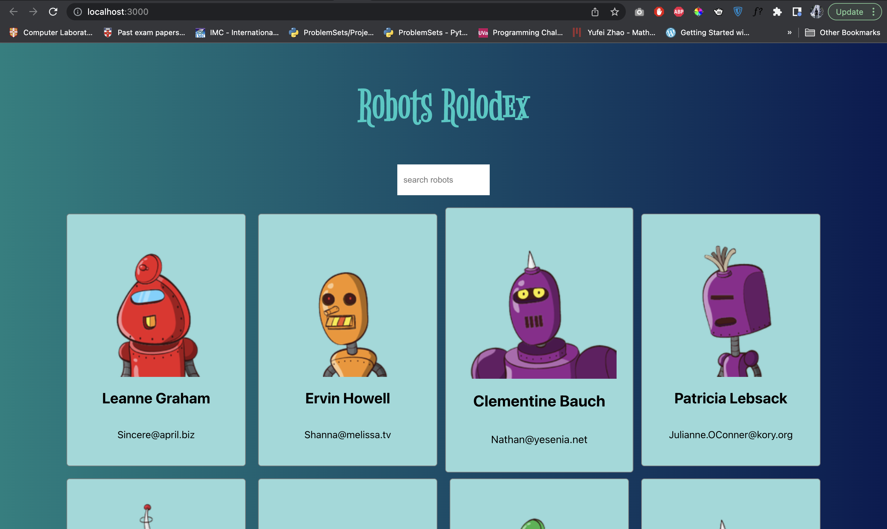

Although using _class components_ is something that most React developers stay away from, learning them can help you in the long run. In this article, we will be creating a small React application using _class components_ while learning the _lifecycle methods_.

## Creating React App

To scaffold our react app, simply go to your terminal and type `npx create-react-app robot-rolodex`. After scaffolding the project open it using your IDE. In my case, I will be using VS Code for `robot-rolodex` project. Therefore, I can simply use the following command, `code robot-rolodex`. After opening it you will see the following folder structure.

```shell
.
├── README.md
├── node_modules
├── package-lock.json
├── package.json
├── public
│   ├── favicon.ico
│   ├── index.html
│   ├── logo192.png
│   ├── logo512.png
│   ├── manifest.json
│   └── robots.txt
└── src
    ├── App.css
    ├── App.js
    ├── App.test.js
    ├── index.css
    ├── index.js
    ├── logo.svg
    ├── reportWebVitals.js
    └── setupTests.js
```

## First React Component

Now, go to `./src/App.js` file and check it. You can see that it is written using a _functional component_.

```js:title=./src/App.js
import logo from './logo.svg';
import './App.css';

function App() {
  return (
    <div className="App">
      <header className="App-header">
        
        <p>
          Edit <code>src/App.js</code> and save to reload.
        </p>
        <a
          className="App-link"
          href="https://reactjs.org"
          target="_blank"
          rel="noopener noreferrer"
        >
          Learn React
        </a>
      </header>
    </div>
  );
}

export default App;
```

Therefore, first, we will convert that _functional component_ into a _class component_. To do that, we need to import _Component_ from the _react_ library. Then, we will change the _function_ to _class_ and use _inheritance_ to make the **App** to a _class component_. After that, we will put the whole `return` block inside the class method `render()` to render.

```js:title=./src/App.js
import {Component} from 'react';
import logo from './logo.svg';
import './App.css';

class App extends Component {
  render(){
    return (
      <div className="App">
        <header className="App-header">
          
          <p>
            Edit <code>src/App.js</code> and save to reload.
          </p>
          <a
            className="App-link"
            href="https://reactjs.org"
            target="_blank"
            rel="noopener noreferrer"
          >
            Learn React
          </a>
        </header>
      </div>
    );
  }
}

export default App;
```

Now, to check whether this is working or not, type `yarn start` or `npm start` in your terminal. `yarn` and `npm` are both package managers, but I prefer using `yarn` in React projects.


## State of a Component

As you have seen, `render()` is a class method that is in all the classes. And like `render()` there is another method named `constructor()` which is available to all the classes as well. Looking at our code, we can see that most of the code in our `App` component are hard coded. To change that, we can try using `constructor()` and the `state` of the components.
Let's first change the `App` component code and analyze it next.

```js:title=./src/App.js
import {Component} from 'react';
import logo from './logo.svg';
import './App.css';

class App extends Component {
  constructor(){
    super();
    this.state = {
      name: 'Nipuna'
    }
  }
  render(){
    return (
      <div className="App">
        <header className="App-header">
          
          <p>
            Hi! {this.state.name}
          </p>
          <button>Change name</button>
        </header>
      </div>
    );
  }
}

export default App;
```

As you can see there is a code line with `super();` inside the constructor. This is to address the `super` class of this `App` class component which is `Component` class. We use this to access the `Component` class before running the other code lines inside the `constructor()`.

And inside `constructor()` method, you can see our `state` variable which is an object for accessing various data inside the component. The `state` variable comes into play when changing the value of a variable declared in the `state` object. For example, assume we need to change the `name` value of the `state` variable when clicking a `button`, we need to use the `state` variable.

But one important fact related to `state` variable is you cannot directly change the value inside it. For example, if you run the following code, the value between `<p>...</p>` tag won't be changing, even if it prints the correct value in the console.

```js:title=./src/App.js
import {Component} from 'react';
import logo from './logo.svg';
import './App.css';

class App extends Component {
  constructor(){
    super();
    this.state = {
      name: 'Nipuna'
    }
  }
  render(){
    return (
      <div className="App">
        <header className="App-header">
          
          <p>
            Hi! {this.state.name}
          </p>
          <button onClick={()=>{
            this.state.name = "Upeksha";
            console.log(this.state.name);
          }}>Change name</button>
        </header>
      </div>
    );
  }
}

export default App;
```


So, why is this happening? This is happening due to the way that React determines on when to re-render a component. React determines to re-render an component, if the `state` has been completely changed or the `state` is a complete different object in the memory.
To understand what React mean by completely different `state`, look at the following console logs.

```js
//case 1
<< const obj1 = {name: 'Nipuna'}

<< const obj2  =  obj1

<< obj1 === obj2
>> true

<< obj2.name = 'Upeksha'

<< obj1
>> {name: 'Upeksha'}

<< obj1 === obj2
>> true

//case 2
<< const obj3 = Object.assign({}, obj1)

<< obj3
>> 'Upeksha'

<< obj1 === obj3
>> false

// case 3
<< const obj4 = {name: 'Upeksha'}

<< obj1 === obj4
>> false
```

In above cases, the objects are completely changed in _case 2_ and _case 3_ only. Like that, the React determines re-rendering if the `state` is completely changed.

So how can we do that? To do that, React provides a special method named `setState()`.

```js:title=./src/App.js
import {Component} from 'react';
import logo from './logo.svg';
import './App.css';

class App extends Component {
  constructor(){
    super();
    this.state = {
      name: 'Nipuna'
    }
  }
  render(){
    return (
      <div className="App">
        <header className="App-header">
          
          <p>
            Hi! {this.state.name}
          </p>
          <button onClick={()=>{
            this.setState({name: "Upeksha"});
          }}>Change name</button>
        </header>
      </div>
    );
  }
}

export default App;
```


The `setState()` method can have two parameters, the value we need to change in the `state` variable and the `callback function`. Although, the second parameter is optional in `setState()` method, using it can help other developers understand the code effortlessly because it will only be running after all the `state` changes are done.

```js:title=./src/App.js
import { Component } from 'react';
import logo from './logo.svg';
import './App.css';

class App extends Component {
  constructor() {
    super();
    this.state = {
      name: 'Nipuna'
    }
  }
  render() {
    return (
      <div className="App">
        <header className="App-header">
          
          <p>
            Hi! {this.state.name}
          </p>
          <button onClick={() => {
            this.setState(
              () => { return { name: "Upeksha" } },
              () => { console.log(this.state.name) });
          }}>Change name</button>
        </header>
      </div>
    );
  }
}

export default App;
```

## Robots Rolodex

To begin our project, we need to sanitize our `App.js` file.

```js:title=./src/App.js
import { Component } from 'react';
import logo from './logo.svg';
import './App.css';

class App extends Component {
  constructor() {
    super();
  }
  render() {
    return (
      <div className="App"></div>
    );
  }
}

export default App;
```

First, we need a data list to show the names of our rolodex. For that, we will be using the following data set. https://jsonplaceholder.typicode.com/users
Now, we can update our `state` and edit our `HTML` inside the `render()` method.

```js:title=./src/App.js
import { Component } from 'react';
import logo from './logo.svg';
import './App.css';

class App extends Component {
  constructor() {
    super();
    this.state = {
      robots: []
    };
  }
  render() {
    return (
      <div className="App">
        {this.state.robots.map(robot => {
          return (
            <div key={robot.id}>
              <h1>{robot.name}</h1>
            </div>
          );
        })}
      </div>
    );
  }
}

export default App;
```

But, when do we need to get the data from the mentioned API? We want that data at the exact moment our React component gets rendered or mounted. In other words, we need to choose the best lifecycle method to get the data from the mentioned API.

## React Lifecycle Methods [1]

In React, components go through a lifecycle of events.

- Mounting → Adding nodes to the DOM
- Updating → Altering existing nodes in the DOM
- Unmounting → Removing nodes from the DOM
- Error handling → Verifying that your code works and is bug-free

You can actually think of these events as component's birth, growth, and death respectively. And error handling is like getting medicine after a health checkup.

Before rendering, the component goes through its mounting, updating and unmounting phases. Mounting is like bringing a newborn baby into the world. At this phase, the component is inserted to the DOM.

After the mounting phase, the React component grows during the updating phase. Without updates, the component would remain as it is when it was initially created in the DOM.

The final phase is called the unmounting phase. At this stage, the component dies or removed from the DOM.

In addition to the above mentioned phases, the React component can gr through another phase named as the error handling phase. This occurs when your code contains bugs or doesn't work as expected.

So, what are React lifecycle methods then?

Each React lifecycle phase has numerous life cycle methods that you can override to run code at specified times during the process. These are commonly known as the component lifecycle methods.

### Mounting lifecycle methods

The following lifecycle methods are called in order during the mounting phase

1. **`constructor()`** → This brings the component to life. This is called before the component is mounted to DOM.
2. **`static getDerivedStateFromProps()`** → This is a new React lifecycle method to replace `componentWillReceiveProps()`\*\*. Its main function is to ensure that the state and props are in sync for when it's required/
3. **`render()`** → If you want to render elements to the DOM, the `render()` method is where you would write them.
4. **`componentDidMount()`** → This function is invoked immediately after the component is mounted to the DOM.

### Updating lifecycle methods

1. **`static getDerivedStateFromProps()`** → This is the first react lifecycle method to be invoked during the updating phase.
2. **`shouldComponentUpdate()`** → If you want a component to rerender when state or props change, you can control it inside this method.
3. **`render()`** → After `shouldComponentUpdate()` method is called `render()` is called immediately after.
4. **`getSnapshotBeforeUpdate()`** → This stores the previous values of the state after the DOM is updated. One important thing to note is the value queried from the DOM in `getSnapshotBeforeUpdate()` refers to the value just before the DOM is updated, even though the `render()` method was previously called.
5. **`componentDidUpdate()`** → Whatever value is returned from the `getSnapshotBeforeUpdate()` lifecycle method is passed as the third argument to the `componentDidUpdate()` method.

### Unmounting lifecycle methods

1. **`componentWillUnmount()`** → This is invoked immediately before a component is unmounted and destroyed.

### Error handling lifecycle methods

1. **`static getDerivedStateFromError()`** → Whenever an error is thrown in a descendant component, this is called first, and the error thrown passed as an argument.
2. **`componentDidCatch()`** → This method is also called after an error in a descendant component is thrown.


### ↩ Back to Robot Rolodex

So what is the lifecycle method that seems best fit for getting the names list from the URL mentioned earlier?

As we need to update the users as soon as the component get rendered. So the lifecycle method that we should use is `componentDidMount()` method.

```js:title=./src/App.js
import { Component } from 'react';
import logo from './logo.svg';
import './App.css';

class App extends Component {
  constructor() {
    super();
    this.state = {
      robots: []
    };
  }

  componentDidMount() {
    fetch('https://jsonplaceholder.typicode.com/users')
      .then(res => res.json())
      .then(users => this.setState(
        () => {
          return { robots: users };
        },
        () => {
          console.log(this.state);
        }
      ));
  }


  render() {
    return (
      <div className="App">
        {this.state.robots.map(robot => {
          return (
            <div key={robot.id}>
              <h1>{robot.name}</h1>
            </div>
          );
        })}
      </div>
    );
  }
}

export default App;
```


Now we can update our `App.js` component to have a new `<input/>` which filters the names that we type and show them in our UI.

```js:./src/App.js
import { Component } from 'react';
import logo from './logo.svg';
import './App.css';

class App extends Component {
  constructor() {
    super();
    this.state = {
      robots: [],
      searchField: ''
    };
  }

  componentDidMount() {
    fetch('https://jsonplaceholder.typicode.com/users')
      .then(res => res.json())
      .then(users => this.setState(
        () => {
          return { robots: users };
        },
        () => {
          console.log(this.state);
        }
      ));
  }


  render() {

    const filteredRobots = this.state.robots.filter((robot)=>{
      return robot.name.toLocaleLowerCase().includes(this.state.searchField);
    });

    return (
      <div className="App">
        <input className="search-box" type="search" placeholder="search robots" onChange={(e)=>{
          console.log(e.target.value);
          const searchField = e.target.value.toLocaleLowerCase();
          this.setState(()=>{
            return {searchField};
          })
        }}/>
        {filteredRobots.map(robot => {
          return (
            <div key={robot.id}>
              <h1>{robot.name}</h1>
            </div>
          );
        })}
      </div>
    );
  }
}

export default App;
```

Here, few things to note are,

- We are using another `state` variable named `searchField` to filter the robots as we type them in the `<input/>` tag.
- Since `const searchField` is same as the `state` variable name we can direclty use it in the `setState()` rather than using `this.setState(()=>{return searchField: searchField});`

Since these are basics of React and not related to the class components and lifecycle methods, we will not dig deep into them.

To optimize the above code we can introduce a new method and put the code inside `onChange()` into that and destructure the `this` and `this.state` variables as shown below.

```js:title=./src/App.js
import { Component } from 'react';
import logo from './logo.svg';
import './App.css';

class App extends Component {
  constructor() {
    super();
    this.state = {
      robots: [],
      searchField: ''
    };
  }

  componentDidMount() {
    fetch('https://jsonplaceholder.typicode.com/users')
      .then(res => res.json())
      .then(users => this.setState(
        () => {
          return { robots: users };
        },
        () => {
          console.log(this.state);
        }
      ));
  }

  onSearchChange = (e) => {
    console.log(e.target.value);
    const searchField = e.target.value.toLocaleLowerCase();
    this.setState(() => {
      return { searchField };
    })
  }

  render() {

    const {robots, searchField} = this.state;
    const {onSearchChange} = this;

    const filteredRobots = this.state.robots.filter((robot) => {
      return robot.name.toLocaleLowerCase().includes(searchField);
    });

    return (
      <div className="App">
        <input className="search-box" type="search" placeholder="search robots" onChange={onSearchChange} />
        {filteredRobots.map(robot => {
          return (
            <div key={robot.id}>
              <h1>{robot.name}</h1>
            </div>
          );
        })}
      </div>
    );
  }
}

export default App;
```

But are those two the only one we can do to optimize this?

No! We can introduce more components and use them in order to simplify our project. To do that create a new folder named `components` under `./src` and create three more folders under that. And then add the respective `.js` and `.css` files to them.

- `card-list`
- `card`
- `search-box`

Now, your file structure would look like this.

```shell
.
├── README.md
├── node_modules
├── package-lock.json
├── package.json
├── public
│   ├── favicon.ico
│   ├── index.html
│   ├── logo192.png
│   ├── logo512.png
│   ├── manifest.json
│   └── robots.txt
└── src
    └── components
    │       └── card
    │       │     ├── card.component.jsx
    │       │     └──card.styles.css
    │       └── card-list
    │       │     ├── card-list.component.jsx
    │       │     └──card-list.styles.css
    │       └── search-box
    │             ├── search-box.component.jsx
    │             └── search-box.styles.css
    ├── App.css
    ├── App.js
    ├── App.test.js
    ├── index.css
    ├── index.js
    ├── logo.svg
    ├── reportWebVitals.js
    └── setupTests.js
```

Since we have learnt about the *class components* and *lifecycle methods* we will optimize the code and finish our project here. To create the images that we need for the cards, we will be using the [robohash](https://robohash.org/) generator. 

```jsx:title=./src/components/card/card.component.jsx
import { Component } from "react";
import "./card.styles.css";

class Card extends Component {
  render() {
    const { name, email, id } = this.props.robot;
    return (
      <div key={id} className="card-container">
        
        <h2>{name}</h2>
        <p>{email}</p>
      </div>
    );
  }
}

export default Card;
```

```css:title=./src/components/card/card.styles.css
.card-container {
  display: flex;
  flex-direction: column;
  background-color: #95dada;
  border: 1px solid grey;
  border-radius: 5px;
  padding: 25px;
  cursor: pointer;
  -moz-osx-font-smoothing: grayscale;
  backface-visibility: hidden;
  transform: translateZ(0);
  transition: transform 0.25s ease-out;
}

.card-container:hover {
  transform: scale(1.05);
}
```

```jsx:title=./src/components/search-box/search-box.component.jsx
import { Component } from "react";
import "./search-box.styles.css";

class SearchBox extends Component {
  render() {
    return (
      <input
        className={`search-box ${this.props.className}`}
        type="search"
        placeholder={this.props.placeholder}
        onChange={this.props.onChangeHandler}
      />
    );
  }
}

export default SearchBox;
```

```css:title=./src/components/search-box/search-box.styles.css
.search-box {
  -webkit-appearance: none;
  border: none;
  outline: none;
  padding: 10px;
  width: 150px;
  line-height: 30px;
  margin-bottom: 30px;
}
```

```jsx:title=./src/components/card-list/card-list.component.jsx
import { Component } from "react";
import Card from "../card/card.component";
import "./card-list.styles.css";

class CardList extends Component {
  render() {
    const { robots } = this.props;
    return (
      <div className="card-list">
        {robots.map((robot) => {
          return <Card robot={robot} />;
        })}
      </div>
    );
  }
}

export default CardList;
```

```css:title=./src/components/card-list/card-list.styles.css
.card-list {
  width: 85vw;
  margin: 0 auto;
  display: grid;
  grid-template-columns: 1fr 1fr 1fr 1fr;
  grid-gap: 20px;
}
```

```js:title=./src/App.js
import { Component } from 'react';
import './App.css';
import CardList from './components/card-list/card-list.component';
import SearchBox from './components/search-box/search-box.component';

class App extends Component {

  constructor() {
    super();

    this.state = {
      robots: [],
      searchField: ''
    };
  }

  componentDidMount() {
    fetch('https://jsonplaceholder.typicode.com/users').then(response => response.json())
      .then(users => this.setState(() => {
        return { robots: users };
      }));
  }

  onSearchChange = (event) => {
    const searchField = event.target.value.toLocaleLowerCase();
    this.setState(() => {
      return { searchField };
    })
  }

  render() {
    const { robots, searchField } = this.state;
    const { onSearchChange } = this;

    const filteredRobots = robots.filter((robot) => {
      return robot.name.toLocaleLowerCase().includes(searchField);
    });

    return (
      <div className="App">
        <h1 className='app-title'>Robots Rolodex</h1>
        <SearchBox className='robots-search-box' onChangeHandler = {onSearchChange} placeholder='search robots'/>
        <CardList robots = {filteredRobots}/>
      </div>
    );
  }
}

export default App;
```

```css:title=./src/App.css
body {
  margin: 0;
  padding: 0;
  font-family: -apple-system, BlinkMacSystemFont, 'Segoe UI', 'Roboto', 'Oxygen',
    'Ubuntu', 'Cantarell', 'Fira Sans', 'Droid Sans', 'Helvetica Neue',
    sans-serif;
  -webkit-font-smoothing: antialiased;
  -moz-osx-font-smoothing: grayscale;
  background: linear-gradient(
    to left,
    rgba(7, 27, 82, 1) 0%,
    rgba(0, 128, 128, 1) 100%
  );
  text-align: center;
}

.app-title{
  margin-top: 75px;
  margin-bottom: 50px;
  font-size: 76px;
  color: #0ccac4;
  font-family: 'Bigelow Rules';
}
```

And we can add the font *Bigelow Rules* in `./public/index.html` by adding the following line,
`<link href="https://fonts.googleapis.com/css2?family=Bigelow+Rules&display=swap" rel="stylesheet"/>`



So one of the important concepts to note in the above files is the way we have used `props`. And you can see that we are also destructuring the `props` for more readability.

Since, this article is on *class components* and *lifecycle methods* I won't be stressing about `props` and how to use them. But I will include some references if you want to learn more about them. 😊 You can find the project we created by accessing this [link](https://github.com/nipunaupeksha/robot-rolodex).

## References

- https://blog.logrocket.com/react-lifecycle-methods-tutorial-examples/
- https://reactjs.org/docs/components-and-props.html

