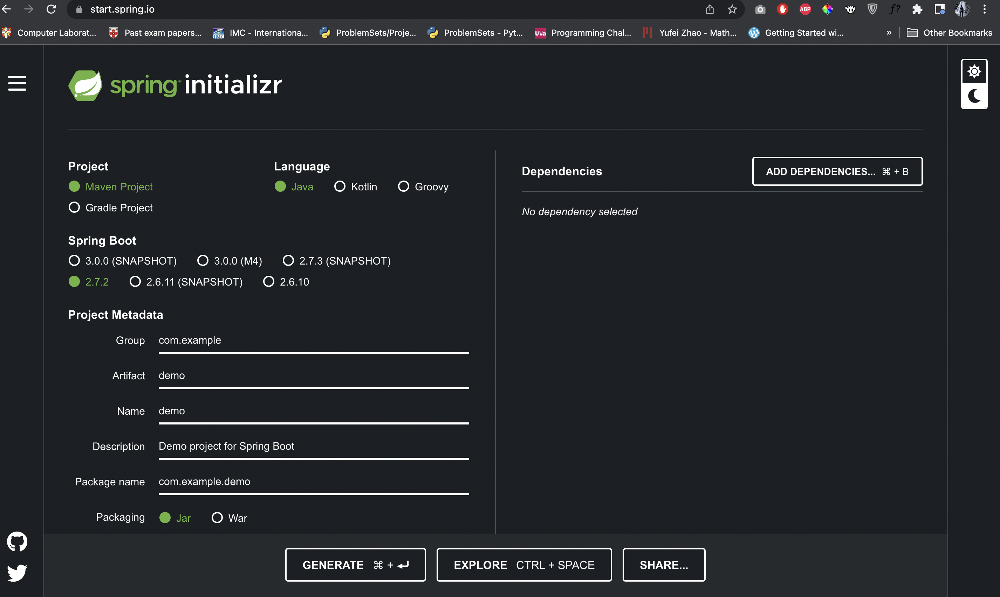
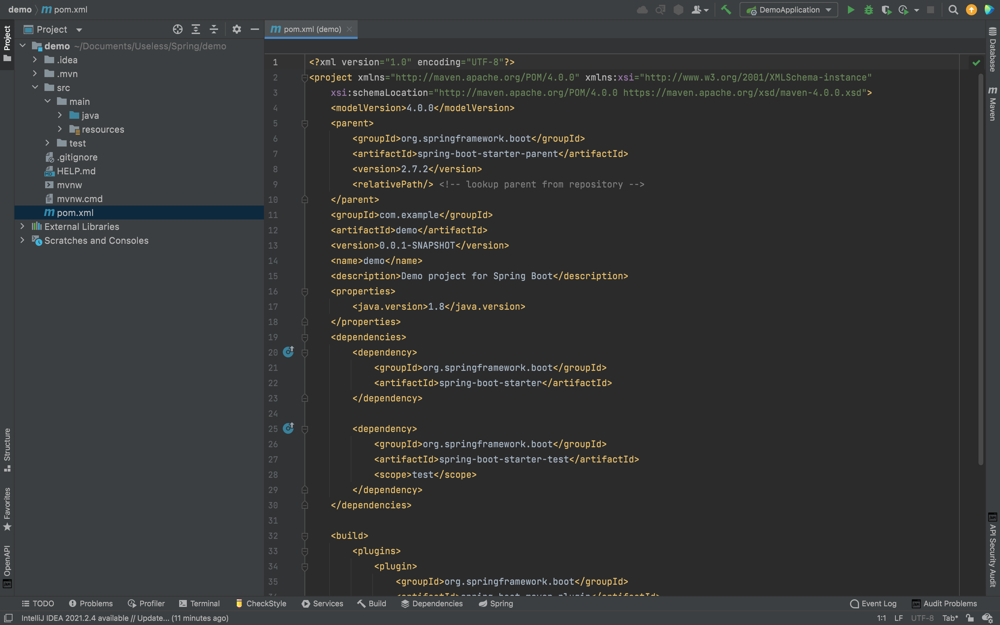

## Dependency Injection

Although dependency injection is an important concept in software engineering, it is actually an easy concept. It basically means providing the objects that another object needs (its dependencies) instead of having that another object construct them itself.

Think of dependency injection like this, think of yourself as a five year old kid. And now when you go and get things out of refrigerator for yourself, you can cause problems. You might leave the door open, you might get something that your parents don't want you to have. You might even be looking for something that don't even have or which has expired. So what you should actually do in this situation is stating a need, "I need something to drink with lunch" and then your parents will make sure you have that something when you sit down to eat. (- John Munsch)

So in simplest terms dependency injection means, giving something that an object have to another object. To get an idea of dependency injection in Spring framework and the common annotations associated with dependency injection, we will create a small program using Spring.

### Types of dependency injection

- By class properties
- By setters
- By constructor

We will try to understand each of them and the most preferred way of dependency injection while implementing them in the project.

## Project Setup

This is fairly an easy project only to give an idea of the dependency injection in Spring. So, we can go to [start.spring.io](https://start.spring.io/) and simply press **generate** button to download a demo pack.



After that, unzip the file you get and open it project using an IDE of you choice (In this article, I will be using IntelliJ IDEA Ultimate Edition).



Now, we need to use `ApplicationContext` as a variable in this project to get a good understanding of the dependency injection. Therefore, we will edit the `DemoApplication.java` file in `src/main/java/com/example/demo`.

```java:title=./src/main/java/com/example/demo/DemoApplication.java
package com.example.demo;

import org.springframework.boot.SpringApplication;
import org.springframework.boot.autoconfigure.SpringBootApplication;
import org.springframework.context.ApplicationContext;

@SpringBootApplication
public class DemoApplication {

	public static void main(String[] args) {

		ApplicationContext ctx = SpringApplication.run(DemoApplication.class, args);
	}
}
```

To test out the three ways of dependency injection we will start with creating two new packages named `services` and `controllers` in `com.example.demo` package.

And in `services` package we will create two new `.java` files, `HelloWorldService.java` and `HelloWorldServiceImpl.java`.

```java:title=./src/java/com/exmpale/demo/services/HelloWorldService.java
package com.example.demo.services;

public interface HelloWorldService{

    String sayHelloWorld();
}
```

```java:title=./src/java/com/exmpale/demo/services/HelloWorldServiceImpl.java
package com.example.demo.services;

public class HelloWorldServiceImpl{

    @Override
    public String sayHelloWorld(){

        return "Hello World!";
    };
}
```

### Property Based Dependency Injection

Now let's create a new `.java` file in `controllers` package named `PropertyInjectedController`.

```java:title=./src/java/com/example/demo/controllers/PropertyInjectedController.java
package com.example.demo.controllers;

import com.example.demo.services.HelloWorldService;

public class PropertyInjectedController{

    public HelloWorldService helloWorldService;

    public String getHelloWorld(){

        return helloWroldService.sayHelloWorld();
    }
}
```

And if we try to run this in our `DemoApplication.java` file using the application context we will get an error.

```java:title=./src/main/java/com/example/demo/DemoApplication.java
package com.example.demo;

import com.example.demo.controllers.PropertyInjectedController;
import org.springframework.boot.SpringApplication;
import org.springframework.boot.autoconfigure.SpringBootApplication;
import org.springframework.context.ApplicationContext;

@SpringBootApplication
public class DemoApplication {

	public static void main(String[] args) {

		ApplicationContext ctx = SpringApplication.run(DemoApplication.class, args);

		PropertyInjectedController propertyInjectedController = (PropertyInjectedController) ctx.getBean("propertyInjectedController");

		System.out.println(propertyInjectedController.getHelloWorld());
	}
}
```

```shell
Exception in thread "main" org.springframework.beans.factory.NoSuchBeanDefinitionException: No bean named 'propertyInjectedController' available
	at org.springframework.beans.factory.support.DefaultListableBeanFactory.getBeanDefinition(DefaultListableBeanFactory.java:874)
	at org.springframework.beans.factory.support.AbstractBeanFactory.getMergedLocalBeanDefinition(AbstractBeanFactory.java:1344)
	at org.springframework.beans.factory.support.AbstractBeanFactory.doGetBean(AbstractBeanFactory.java:309)
	at org.springframework.beans.factory.support.AbstractBeanFactory.getBean(AbstractBeanFactory.java:208)
	at org.springframework.context.support.AbstractApplicationContext.getBean(AbstractApplicationContext.java:1154)
	at com.example.demo.DemoApplication.main(DemoApplication.java:15)
```

This is because spring does not know that `PropertyInjectedController` is a managed component. To fix this, you can add the `@Controller` annotation in the `PropertyInjectedController`.

```java:title=./src/java/com/example/demo/controllers/PropertyInjectedController.java
package com.example.demo.controllers;

import com.example.demo.services.HelloWorldService;
import org.springframework.stereotype.Controller;

@Controller
public class PropertyInjectedController {

    public HelloWorldService helloWorldService;

    public String getHelloWorld(){

        return helloWorldService.sayHelloWorld();
    }
}
```

But now when we run it again, we will get a different error.

```shell
Exception in thread "main" java.lang.NullPointerException
	at com.example.demo.controllers.PropertyInjectedController.getHelloWorld(PropertyInjectedController.java:13)
	at com.example.demo.DemoApplication.main(DemoApplication.java:17)
```

This happens because Spring doesn't know whether it should inject the `HelloWorldService` or not. To fix this we can add the `@Autowired` annotation.

```java:title=./src/java/com/example/demo/controllers/PropertyInjectedController.java
package com.example.demo.controllers;

import com.example.demo.services.HelloWorldService;
import org.springframework.beans.factory.annotation.Autowired;
import org.springframework.stereotype.Controller;

@Controller
public class PropertyInjectedController {

    @Autowired
    public HelloWorldService helloWorldService;

    public String getHelloWorld(){

        return helloWorldService.sayHelloWorld();
    }
}
```

And after fixing that and running it, you will face another error.

```shell
Error starting ApplicationContext. To display the conditions report re-run your application with 'debug' enabled.
2022-08-11 00:37:01.382 ERROR 16099 --- [           main] o.s.b.d.LoggingFailureAnalysisReporter   :

***************************
APPLICATION FAILED TO START
***************************

Description:

Field helloWorldService in com.example.demo.controllers.PropertyInjectedController required a bean of type 'com.example.demo.services.HelloWorldService' that could not be found.

The injection point has the following annotations:
	- @org.springframework.beans.factory.annotation.Autowired(required=true)


Action:

Consider defining a bean of type 'com.example.demo.services.HelloWorldService' in your configuration.


Process finished with exit code 1
```

This happens because Spring fails to identify the service as a service component. To fix this you add `@Service` in the `HelloWorldServiceImpl` class.

```java:title=./src/java/com/example/demo/serivces/HelloWorldServiceImpl.java
package com.example.demo.services;

import org.springframework.stereotype.Service;

@Service
public class HelloWorldServiceImpl implements HelloWorldService {

    @Override
    public String sayHelloWorld() {

        return "Hello World";
    }
}
```

And now we will get the expected output.

```shell
2022-08-11 00:41:12.493  INFO 16693 --- [           main] com.example.demo.DemoApplication         : No active profile set, falling back to 1 default profile: "default"
2022-08-11 00:41:13.137  INFO 16693 --- [           main] com.example.demo.DemoApplication         : Started DemoApplication in 1.061 seconds (JVM running for 1.983)
Hello World

Process finished with exit code 0
```

### Setter Based Dependency Injection

To see the functionality of the setter based dependency injection, we can create a new `.java` file in the `controllers` package named `SetterInjectedController.java`.

```java:title=./src/java/com/example/demo/controllers/SetterInjectedController.java
package com.example.demo.controllers;

import com.example.demo.services.HelloWorldService;
import org.springframework.stereotype.Controller;

@Controller
public class SetterInjectedController {

    private HelloWorldService helloWorldService;

    public void setHelloWorldService(HelloWorldService helloWorldService){

        this.helloWorldService = helloWorldService;
    }

    public String getHelloWorld(){

        return helloWorldService.sayHelloWorld();
    }
}
```

In this `SetterInjectedController` file you can notice that, an instance of `HelloWorldService` is set to the instance variable `helloWorldService` using a setter method. Now if we run this in the `DemoApplication`, we will get the following error.

```java:title=./src/main/java/com/example/demo/DemoApplication.java
package com.example.demo;

import com.example.demo.controllers.PropertyInjectedController;
import com.example.demo.controllers.SetterInjectedController;
import org.springframework.boot.SpringApplication;
import org.springframework.boot.autoconfigure.SpringBootApplication;
import org.springframework.context.ApplicationContext;

@SpringBootApplication
public class DemoApplication {

	public static void main(String[] args) {

		ApplicationContext ctx = SpringApplication.run(DemoApplication.class, args);

		//PropertyInjectedController propertyInjectedController = (PropertyInjectedController) ctx.getBean("propertyInjectedController");
		//System.out.println(propertyInjectedController.getHelloWorld());

		SetterInjectedController
				setterInjectedController = (SetterInjectedController) ctx.getBean("setterInjectedController");
		System.out.println(setterInjectedController.getHelloWorld());
	}
}
```

```shell
Exception in thread "main" java.lang.NullPointerException
	at com.example.demo.controllers.SetterInjectedController.getHelloWorld(SetterInjectedController.java:16)
	at com.example.demo.DemoApplication.main(DemoApplication.java:21)
```

As you can see the error is similar to the one we had in the `PropertInjectedController` class. To fix this, we can use the same annotation we used for `PropertyInjectedController` class, the `@Autowired` annotation.

```java:title=./src/java/com/example/demo/controllers/SetterInjectedController.java
package com.example.demo.controllers;

import com.example.demo.services.HelloWorldService;
import org.springframework.beans.factory.annotation.Autowired;
import org.springframework.stereotype.Controller;

@Controller
public class SetterInjectedController {

    private HelloWorldService helloWorldService;

    @Autowired
    public void setHelloWorldService(HelloWorldService helloWorldService){

        this.helloWorldService = helloWorldService;
    }

    public String getHelloWorld(){

        return helloWorldService.sayHelloWorld();
    }
}
```

And after fixing this we will get the expected output.

```shell
2022-08-11 08:36:10.088  INFO 26147 --- [           main] com.example.demo.DemoApplication         : No active profile set, falling back to 1 default profile: "default"
2022-08-11 08:36:10.881  INFO 26147 --- [           main] com.example.demo.DemoApplication         : Started DemoApplication in 1.225 seconds (JVM running for 2.616)
Hello World

Process finished with exit code 0
```

### Constructor Based Dependency Injection

To see the functionality of the constructor based dependency injection we can create a new file in `controllers` package, `ConstructorInjectedController`.

```java:title=./src/java/com/example/demo/controllers/ConstructorInjectedController.java
package com.example.demo.controllers;

import com.example.demo.services.HelloWorldService;
import org.springframework.stereotype.Controller;

@Controller
public class ConstructorInjectedController {

    private final HelloWorldService helloWorldService;

    public ConstructorInjectedController(HelloWorldService helloWorldService) {

        this.helloWorldService = helloWorldService;
    }

    public String getHelloWorld() {

        return helloWorldService.sayHelloWorld();
    }
}
```

And after adding the following lines in the `DemoApplication` and running it, you will notice that there are no errors.

```java:title=./src/main/java/com/example/demo/DemoApplication.java
package com.example.demo;

import com.example.demo.controllers.ConstructorInjectedController;
import com.example.demo.controllers.PropertyInjectedController;
import com.example.demo.controllers.SetterInjectedController;
import org.springframework.boot.SpringApplication;
import org.springframework.boot.autoconfigure.SpringBootApplication;
import org.springframework.context.ApplicationContext;

@SpringBootApplication
public class DemoApplication {

	public static void main(String[] args) {

		ApplicationContext ctx = SpringApplication.run(DemoApplication.class, args);

		//PropertyInjectedController propertyInjectedController = (PropertyInjectedController) ctx.getBean("propertyInjectedController");
		//System.out.println(propertyInjectedController.getHelloWorld());

		//SetterInjectedController setterInjectedController = (SetterInjectedController) ctx.getBean("setterInjectedController");
		//System.out.println(setterInjectedController.getHelloWorld());

		ConstructorInjectedController constructorInjectedController = (ConstructorInjectedController) ctx.getBean("constructorInjectedController");
		System.out.println(constructorInjectedController.getHelloWorld());
	}
}
```

```shell
2022-08-11 08:49:29.424  INFO 27748 --- [           main] com.example.demo.DemoApplication         : No active profile set, falling back to 1 default profile: "default"
2022-08-11 08:49:30.296  INFO 27748 --- [           main] com.example.demo.DemoApplication         : Started DemoApplication in 1.24 seconds (JVM running for 2.227)
Hello World
```

This is because adding the `@Autowired` annotation above constructor is optional for Constructor Based DI.

So now let's try to find what is the best way to inject dependencies using these three ways.

You can notice that in property based dependency injection we had to use a `public` variable and that violates encapsulation in OOP. And in setter based dependency injection we were doing ok with a `private` variable. And in constructor based injection we were able to use it as a `private final` variable. So, it is obvious that property based dependency injection is bad and other two are good. But what is the best way to inject dependencies? It is actually constructor based dependency injection, because it is not using `@Autowired` annotation and the dependency is injected at runtime fully utilizing the inversion of control(inversion of control means injecting dependencies in run time).

### Concrete classes vs. Interfaces

In our example project, we always used an interface instance(`HelloWorldService`) as the instance variable rather than using a concrete class variable(`HelloWorldServiceImpl`). This is because the interface variables support the interface segregation principle in SOLID principles and inversion of control can be done on runtime. And also, it makes the code more testable.

### Additional Annotations

### `@Qualifier` Annotation

Currently we only have one implementation of `HelloWorldService` and what if we needed to inject a specific inject service for our setter and constructor based dependency injection classes (`SetterInjectedController` and `ConstructorInjectedController`). So what we can do is use the `@Qualifier` annotation. To do that we will create three new classes in the `services` package.

```java:title=./src/main/java/com/example/demo/services/PropertyInjectedGreetingService.java
package com.example.demo.services;
import org.springframework.stereotype.Service;

@Service
public class PropertyInjectedGreetingService implements HelloWorldService{

    @Override
    public String sayHelloWorld() {

        return "Hello World - property";
    }
}
```

```java:title=./src/main/java/com/example/demo/services/SetterInjectedGreetingService.java
package com.example.demo.services;
import org.springframework.stereotype.Service;

@Service
public class SetterInjectedGreetingService implements HelloWorldService{

    @Override
    public String sayHelloWorld() {

        return "Hello World - setter";
    }
}
```

```java:title=./src/main/java/com/example/demo/services/ConstructorInjectedGreetingService.java
package com.example.demo.services;
import org.springframework.stereotype.Service;

@Service
public class ConstructorInjectedGreetingService implements HelloWorldService{

    @Override
    public String sayHelloWorld() {

        return "Hello World - constructor";
    }
}
```

And now if we run this we will get the following error.

```shell
Action:

Consider marking one of the beans as @Primary, updating the consumer to accept multiple beans, or using @Qualifier to identify the bean that should be consumed


Process finished with exit code 1
```

This is because spring is unable to know which dependency to inject. To fix that we can either use `@Primary` or `@Qualifier` annotation. Here, we will use the `@Qualifier` annotation. To do that, we need to change our controller classes as given below.

```java:title=./src/java/com/example/demo/controllers/PropertyInjectedController.java
package com.example.demo.controllers;

import com.example.demo.services.HelloWorldService;
import org.springframework.beans.factory.annotation.Autowired;
import org.springframework.beans.factory.annotation.Qualifier;
import org.springframework.stereotype.Controller;

@Controller
public class PropertyInjectedController {

    @Qualifier("propertyInjectedGreetingService")
    @Autowired
    public HelloWorldService helloWorldService;

    public String getHelloWorld(){

        return helloWorldService.sayHelloWorld();
    }
}
```

```java:title=./src/java/com/example/demo/controllers/SetterInjectedController.java
package com.example.demo.controllers;

import com.example.demo.services.HelloWorldService;
import org.springframework.beans.factory.annotation.Autowired;
import org.springframework.beans.factory.annotation.Qualifier;
import org.springframework.stereotype.Controller;

@Controller
public class SetterInjectedController {

    private HelloWorldService helloWorldService;

    @Qualifier("setterInjectedGreetingService")
    @Autowired
    public void setHelloWorldService(HelloWorldService helloWorldService){
        this.helloWorldService = helloWorldService;
    }

    public String getHelloWorld(){
        return helloWorldService.sayHelloWorld();
    }

}
```

```java:title=./src/java/com/example/demo/controllers/ConstructorInjectedController.java
package com.example.demo.controllers;

import com.example.demo.services.HelloWorldService;
import org.springframework.beans.factory.annotation.Qualifier;
import org.springframework.stereotype.Controller;

@Controller
public class ConstructorInjectedController {

    private final HelloWorldService helloWorldService;

    public ConstructorInjectedController(@Qualifier("constructorInjectedGreetingService") HelloWorldService helloWorldService) {

        this.helloWorldService = helloWorldService;
    }

    public String getHelloWorld() {

        return helloWorldService.sayHelloWorld();
    }
}
```

And if we run the `DemoApplication` it will give the following results.

```java:title=./src/main/java/com/example/demo/DemoApplication.java
package com.example.demo;

import com.example.demo.controllers.ConstructorInjectedController;
import com.example.demo.controllers.PropertyInjectedController;
import com.example.demo.controllers.SetterInjectedController;
import org.springframework.boot.SpringApplication;
import org.springframework.boot.autoconfigure.SpringBootApplication;
import org.springframework.context.ApplicationContext;

@SpringBootApplication
public class DemoApplication {

	public static void main(String[] args) {

		ApplicationContext ctx = SpringApplication.run(DemoApplication.class, args);

		PropertyInjectedController propertyInjectedController = (PropertyInjectedController) ctx.getBean("propertyInjectedController");
		System.out.println(propertyInjectedController.getHelloWorld());

		SetterInjectedController setterInjectedController = (SetterInjectedController) ctx.getBean("setterInjectedController");
		System.out.println(setterInjectedController.getHelloWorld());

		ConstructorInjectedController constructorInjectedController = (ConstructorInjectedController) ctx.getBean("constructorInjectedController");
		System.out.println(constructorInjectedController.getHelloWorld());
	}
}
```

```shell
2022-08-11 14:20:08.071  INFO 61412 --- [           main] com.example.demo.DemoApplication         : No active profile set, falling back to 1 default profile: "default"
2022-08-11 14:20:08.865  INFO 61412 --- [           main] com.example.demo.DemoApplication         : Started DemoApplication in 1.13 seconds (JVM running for 2.095)
Hello World - property
Hello World - setter
Hello World - constructor
```

And it is important that you note that we give the class name with the `@Qualifier` annotation and rather than starting it with upper case we are starting it with lower case.

### `@Primary` Annotation

To illustrate how `@Primary` annotation works, we can create a new class in the `controllers` named `PrimaryController`.

```java:title=./src/java/com/example/demo/controllers/ConstructorInjectedController.java
package com.example.demo.controllers;

import com.example.demo.services.HelloWorldService;

import org.springframework.stereotype.Controller;

@Controller
public class PrimaryController {

    private final HelloWorldService helloWorldService;

    public PrimaryController(HelloWorldService helloWorldService) {

        this.helloWorldService = helloWorldService;
    }

    public String getHelloWorld() {

        return helloWorldService.sayHelloWorld();
    }
}
```

And we can add the `@Primary` annotation to our `HelloWorldServiceImpl` class.

```java:title=./src/main/java/com/example/demo/services/HelloWorldServiceImpl.java
package com.example.demo.services;

import org.springframework.context.annotation.Primary;
import org.springframework.stereotype.Service;

@Primary
@Service
public class HelloWorldServiceImpl implements HelloWorldService {

    @Override
    public String sayHelloWorld() {

        return "Hello World";
    }
}
```

And now, if we add this to our `DemoApplication` we can have our result as expected.

```java:title=./src/main/java/com/example/demo/DemoApplication.java
package com.example.demo;

import com.example.demo.controllers.ConstructorInjectedController;
import com.example.demo.controllers.PrimaryController;
import com.example.demo.controllers.PropertyInjectedController;
import com.example.demo.controllers.SetterInjectedController;
import org.springframework.boot.SpringApplication;
import org.springframework.boot.autoconfigure.SpringBootApplication;
import org.springframework.context.ApplicationContext;

@SpringBootApplication
public class DemoApplication {

	public static void main(String[] args) {

		ApplicationContext ctx = SpringApplication.run(DemoApplication.class, args);

		PropertyInjectedController propertyInjectedController = (PropertyInjectedController) ctx.getBean("propertyInjectedController");
		System.out.println(propertyInjectedController.getHelloWorld());

		SetterInjectedController setterInjectedController = (SetterInjectedController) ctx.getBean("setterInjectedController");
		System.out.println(setterInjectedController.getHelloWorld());

		ConstructorInjectedController constructorInjectedController = (ConstructorInjectedController) ctx.getBean("constructorInjectedController");
		System.out.println(constructorInjectedController.getHelloWorld());

		PrimaryController primaryController = (PrimaryController) ctx.getBean("primaryController");
		System.out.println(primaryController.getHelloWorld());
	}
}
```

```shell
2022-08-11 14:49:10.163  INFO 64755 --- [           main] com.example.demo.DemoApplication         : No active profile set, falling back to 1 default profile: "default"
2022-08-11 14:49:11.040  INFO 64755 --- [           main] com.example.demo.DemoApplication         : Started DemoApplication in 1.259 seconds (JVM running for 2.378)
Hello World - property
Hello World - setter
Hello World - constructor
Hello World
```

### `@Profile` Annotation

`@Profile` is an annotation that can be used with spring to configure different configurations based on the your need. For example, if you have been using H2 database in the development environment and want to use MySQL in the production environment you can use `@Profile` annotation to switch from one another. To illustrate the functionality of the `@Profile` annotation we will create a new controller in the `controllers` named `I18nController`.

```java:title=./src/main/java/com/example/demo/controllers/I18nController.java
package com.example.demo.controllers;

import com.example.demo.services.HelloWorldService;
import org.springframework.stereotype.Controller;

@Controller
public class I18nController {

    private final HelloWorldService helloWorldService;

    public I18nController(HelloWorldService helloWorldService) {

        this.helloWorldService = helloWorldService;
    }

    public String getHelloWorld() {

        return helloWorldService.sayHelloWorld();
    }
}
```

And we will create two new services in the `services` folder, `I18nEnglishService` and `I18nGermanService`. And rather than using the `@Service` annotation without any attributes in it, we will give it a qualifier, `@Service("i18nService")`;

```java:title=./src/main/java/com/example/demo/services/I18nEnglishService.java
package com.example.demo.services;

import org.springframework.stereotype.Service;

@Service("i18nService")
public class I18nEnglishService implements HelloWorldService{

    @Override
    public String sayHelloWorld() {

        return "Hello World - en";
    }
}
```

```java:title=./src/main/java/com/example/demo/services/I18nGermanService.java
package com.example.demo.services;

import org.springframework.stereotype.Service;

@Service("i18nService")
public class I18nGermanService implements HelloWorldService{

    @Override
    public String sayHelloWorld() {

        return "Hallo Welt - de";
    }
}
```

And after that we will include that qualifier in our controller.

```java:title=./src/main/java/com/example/demo/controllers/I18nController.java
package com.example.demo.controllers;

import com.example.demo.services.HelloWorldService;
import org.springframework.stereotype.Controller;
import org.springframework.beans.factory.annotation.Qualifier;

@Controller
public class I18nController {

    private final HelloWorldService helloWorldService;

    public I18nController(@Qualifier("i18nService")HelloWorldService helloWorldService) {

        this.helloWorldService = helloWorldService;
    }

    public String getHelloWorld() {

        return helloWorldService.sayHelloWorld();
    }
}
```

So if I run this, spring cannot understand which service that I want, so that it will give an error.

```java:title=./src/main/java/com/example/demo/DemoApplication.java
package com.example.demo;

import com.example.demo.controllers.ConstructorInjectedController;
import com.example.demo.controllers.I18nController;
import com.example.demo.controllers.PrimaryController;
import com.example.demo.controllers.PropertyInjectedController;
import com.example.demo.controllers.SetterInjectedController;
import org.springframework.boot.SpringApplication;
import org.springframework.boot.autoconfigure.SpringBootApplication;
import org.springframework.context.ApplicationContext;

@SpringBootApplication
public class DemoApplication {

	public static void main(String[] args) {

		ApplicationContext ctx = SpringApplication.run(DemoApplication.class, args);

		PropertyInjectedController propertyInjectedController = (PropertyInjectedController) ctx.getBean("propertyInjectedController");
		System.out.println(propertyInjectedController.getHelloWorld());

		SetterInjectedController setterInjectedController = (SetterInjectedController) ctx.getBean("setterInjectedController");
		System.out.println(setterInjectedController.getHelloWorld());

		ConstructorInjectedController constructorInjectedController = (ConstructorInjectedController) ctx.getBean("constructorInjectedController");
		System.out.println(constructorInjectedController.getHelloWorld());

		PrimaryController primaryController = (PrimaryController) ctx.getBean("primaryController");
		System.out.println(primaryController.getHelloWorld());

		I18nController i18nController = (I18nController) ctx.getBean("i18nController");
		System.out.println(i18nController.getHelloWorld());
	}
}
```

```shell
Caused by: org.springframework.context.annotation.ConflictingBeanDefinitionException: Annotation-specified bean name 'i18nService' for bean class [com.example.demo.services.I18nGermanService] conflicts with existing, non-compatible bean definition of same name and class [com.example.demo.services.I18nEnglishService]
	at org.springframework.context.annotation.ClassPathBeanDefinitionScanner.checkCandidate(ClassPathBeanDefinitionScanner.java:349) ~[spring-context-5.3.22.jar:5.3.22]
	at org.springframework.context.annotation.ClassPathBeanDefinitionScanner.doScan(ClassPathBeanDefinitionScanner.java:287) ~[spring-context-5.3.22.jar:5.3.22]
	at org.springframework.context.annotation.ComponentScanAnnotationParser.parse(ComponentScanAnnotationParser.java:128) ~[spring-context-5.3.22.jar:5.3.22]
	at org.springframework.context.annotation.ConfigurationClassParser.doProcessConfigurationClass(ConfigurationClassParser.java:296) ~[spring-context-5.3.22.jar:5.3.22]
	at org.springframework.context.annotation.ConfigurationClassParser.processConfigurationClass(ConfigurationClassParser.java:250) ~[spring-context-5.3.22.jar:5.3.22]
	at org.springframework.context.annotation.ConfigurationClassParser.parse(ConfigurationClassParser.java:207) ~[spring-context-5.3.22.jar:5.3.22]
	at org.springframework.context.annotation.ConfigurationClassParser.parse(ConfigurationClassParser.java:175) ~[spring-context-5.3.22.jar:5.3.22]
	... 12 common frames omitted
```

To fix that first we need to add `@Profile` for those two services and add a new configuration in our `./src/main.resources/application.properties` file.

```java:title=./src/main/java/com/example/demo/services/I18nEnglishService.java
package com.example.demo.services;

import org.springframework.context.annotation.Profile;
import org.springframework.stereotype.Service;

@Profile("EN")
@Service("i18nService")
public class I18nEnglishService implements HelloWorldService{

    @Override
    public String sayHelloWorld() {

        return "Hello World - en";
    }
}
```

```java:title=./src/main/java/com/example/demo/services/I18nGermanService.java
package com.example.demo.services;

import org.springframework.context.annotation.Profile;
import org.springframework.stereotype.Service;

@Profile("DE")
@Service("i18nService")
public class I18nGermanService implements HelloWorldService{

    @Override
    public String sayHelloWorld() {

        return "Hallo Welt - de";
    }
}
```

```properties:title=./src/main.resources/application.properties
spring.profiles.active=DE
```

And now we get the expected result.

```shell
2022-08-11 15:14:33.881  INFO 67839 --- [           main] com.example.demo.DemoApplication         : The following 1 profile is active: "DE"
2022-08-11 15:14:34.558  INFO 67839 --- [           main] com.example.demo.DemoApplication         : Started DemoApplication in 1.113 seconds (JVM running for 2.42)
Hello World - property
Hello World - setter
Hello World - constructor
Hello World
Hallo Welt - de
```

But, what if we don't want to add configurations in `application.properties` file. Then we can use the `default` keyword to make a profile default. To do that you have to add `default` to the `@Profile` annotation. For instnace, if we need to make the `I18nGermanService` default, we can do the following.

```java:title=./src/main/java/com/example/demo/services/I18nGermanService.java
package com.example.demo.services;

import org.springframework.context.annotation.Profile;
import org.springframework.stereotype.Service;

@Profile({"DE","default"})
@Service("i18nService")
public class I18nGermanService implements HelloWorldService{

    @Override
    public String sayHelloWorld() {

        return "Hallo Welt - de";
    }
}
```

And now if we don't include the profile configuration in `application.properties` file, the `I18nGermanService` will be selected as the default service by Spring.

## Conclusion

In this article, we looked at different ways of injecting dependencies and annotations that we could use with dependecy injection. To find more about dependency injection you can use the following resources.

- [Baeldung](https://www.baeldung.com/spring-dependency-injection)
- [Javatpoint](https://www.javatpoint.com/dependency-injection-in-spring)

And finally, you can find the **demo** project from [here](https://github.com/nipunaupeksha/spring-di).
