# Pet Clinic App

Most of the people, specially who are new to Java Web Application Development, get stuck at learning Spring even though there are lots of great books and courses are available to learn Spring. This is because, what they don't tell you in those books and courses is learning concepts won't help you creating projects. So in this article, we will create a new spring application while learning all the stuff that you need to create your first Spring application.

# Step 1 - Spring Initializr

`Spring initializr` is an online tool which you can access from [here](https://start.spring.io/) which simplifies Spring development. Therefore, our first step will be scaffolding our project using `Spring Initializr` and running it on _IntelliJ IDEA Ultimate Edition_ (You can use any IDE of your preference but I will be using IntelliJ IDEA Ultimate Edition).

Visit [start.spring.io](https://start.spring.io/) and change the following **_meta data_** of the project.

- Project: **`Maven`**
- Language: **`Java`**
- Spring Boot: **`2.7.3`**
- Group: **`com.flt`**
- Artifact: **`pet-clinic`**
- Name: **`pet-clinic`**
- Description: **`Pet Clinic Web Application`**
- Package name: **`com.flt.pet-clinic`**
- Packaging: **`jar`**
- Java: **`8`**

And add the followind dependencies and press `Generate` button to download the project zip file.

- Spring Web
- Spring Dev Tools
- Lombok
- Thymeleaf
- MySQL Driver
- H2 Database
- Spring Data JPA
- Spring Boot Actuator

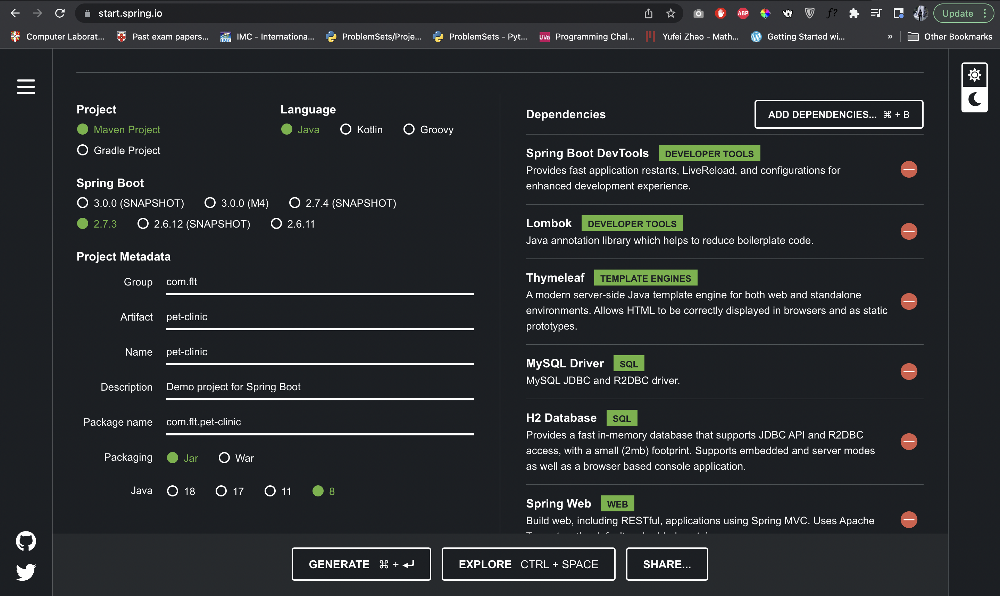

After unzipping the file, open the project using IntelliJ IDEA.

```shell
.
├── HELP.md
├── mvnw
├── mvnw.cmd
├── pom.xml
└── src
    ├── main
    │   ├── java
    │   │   └── com.flt.petclinic
    │   │               └── PetClinicApplication.java
    │   └── resources
    │       ├── application.properties
    │       ├── static
    │       └── templates
    └── test
        └── java
            └── com.flt.petclinic
                        └── PetClinicApplicationTests.java
```

Now, if we want to run the project we can simply go to `PetClinicApplication.java` file and click the gutter icon or click the `PetClinicApplication` in the navigation bar. And after some time the application will start up in the default port 8080.

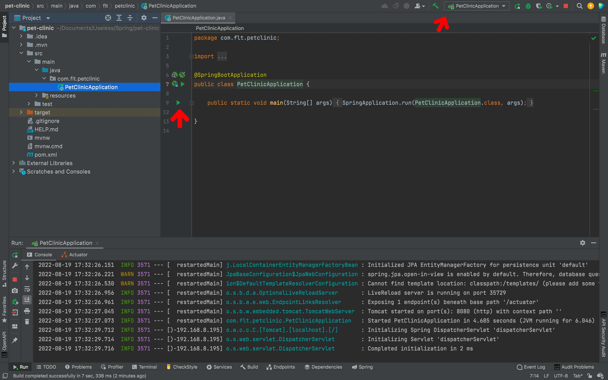

## Step 2 - Implement Pet Clinic POJO Data Model

To implement our POJOs, first, we need to create a new package named `models` inside `com.flt.petclinic`. Then right click on the `model` package and select `New → Java Class`. Then a popup will open with four options `Class`, `Interface`, `Enum` and `Annotation`. You can use arrow keys to select the type of Java class you need. In our case, we need the default `Class`. So, we will select it and type `Person` for its name. Inside that `Person` class we will declare two attributes, `firstName` and `lastName`. After declaring the attributes you can press `command + N` (in Mac) to generate getters and setters (Shortcuts for Windows and Linux users).

```java:title=./src/main/java/com/flt/petclinic/model/Person.java
package com.flt.petclinic.model;

public class Person {

    private String firstName;
    private String lastName;

    public String getFirstName() {

        return firstName;
    }

    public void setFirstName(String firstName) {

        this.firstName = firstName;
    }

    public String getLastName() {

        return lastName;
    }

    public void setLastName(String lastName) {

        this.lastName = lastName;
    }
}

```

After creating `Person` class we will create four more classes for `Vet`, `Owner`, `PetType` and `Pet`.

```java:title=./src/main/java/com/flt/petclinic/model/Vet.java
package com.flt.petclinic.model;

public class Vet extends Person{

}
```

```java:title=./src/main/java/com/flt/petclinic/model/Owner.java
package com.flt.petclinic.model;

public class Owner extends Person{

}
```

```java:title=./src/main/java/com/flt/petclinic/model/PetType.java
package com.flt.petclinic.model;

public class PetType {

    private String name;

    public String getName() {

        return name;
    }

    public void setName(String name) {

        this.name = name;
    }
}
```

```java:title=./src/main/java/com/flt/petclinic/model/Pet.java
package com.flt.petclinic.model;

import java.time.LocalDate;

public class Pet {

    private PetType petType;
    private Owner owner;
    private LocalDate birthDate;

    public PetType getPetType() {

        return petType;
    }

    public void setPetType(PetType petType) {

        this.petType = petType;
    }

    public Owner getOwner() {

        return owner;
    }

    public void setOwner(Owner owner) {

        this.owner = owner;
    }

    public LocalDate getBirthDate() {

        return birthDate;
    }

    public void setBirthDate(LocalDate birthDate) {

        this.birthDate = birthDate;
    }
}
```

The POJOs we created are the basic ones that we will be working on. But, as the project go, we will be implementing new attributes to incorporate new features to the project.

## Step 3 - Create Mult-Module Project for Data Model

Although, we can create our pet-clinic application as a single module, it is important to know about how to create multi-module projects in Spring. We will be creating two modules, `pet-clinic-data` and `pet-clinic-web` and refator the POJOs we built accordingly. To create new modules right click on our project `pet-clinic` and select `New → Module`. From the pop-up select `Maven` as the module type and press `Next`. Give the name of the project as `pet-clinic-data` and press `Finish`.

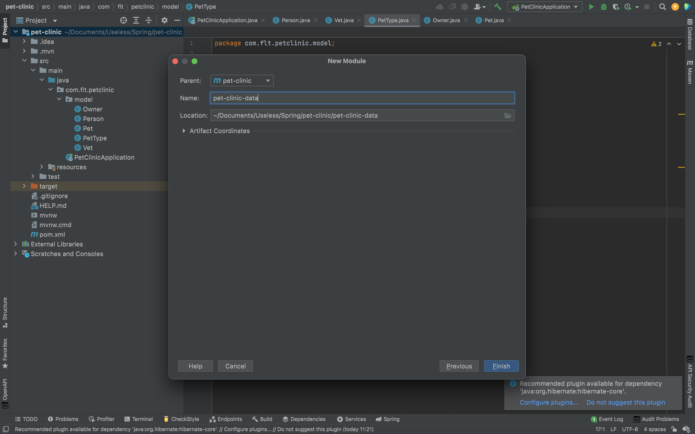

Create another module named `pet-clinic-web` using the same way mentioned above.

After creting the two modules, create a new package in `pet-clinic-web/src/main/java` named `com.flt.petclinic` and drag and drop the `PetClinicApplication.java` file to that package. And a pop-up will come aksing whether you need to move the file or not. Click `refactor` to move the file to the `pet-clinic-web` module. Then move the `resources` of the root project to `pet-clinic-web/src/main/resources` as well. After that, create another new package in `pet-clinic-web/src/test/java` named `com.flt.petclinic` and drag and drop the `PetClinicApplicationTests.java` file to that package.

After moving those to the `pet-clinic-web`, move the `com.flt.petclinic` in the root project (which has `model` package) to the `pet-clinic-data/main/java` folder. After moving every file in the `pet-clinic/src` folder of the root project you can delete the `pet-clinic/src` folder from the root project. After all these moving around things, your project will look like this.

```shell
.
├── HELP.md
├── mvnw
├── mvnw.cmd
├── pet-clinic-data
│   ├── pom.xml
│   └── src
│       ├── main
│       │   ├── java
│       │   │   └── com.flt.petclinic
│       │   │               └── model
│       │   │                   ├── Owner.java
│       │   │                   ├── Person.java
│       │   │                   ├── Pet.java
│       │   │                   ├── PetType.java
│       │   │                   └── Vet.java
│       │   └── resources
│       └── test
│           └── java
├── pet-clinic-web
│   ├── pom.xml
│   └── src
│       ├── main
│       │   ├── java
│       │   │   └── com.flt.petclinic
│       │   │               └── PetClinicApplication.java
│       │   └── resources
│       │       ├── application.properties
│       │       ├── static
│       │       └── templates
│       └── test
│           └── java
│               └── com.flt.petclinic
│                           └── PetClinicApplicationTests.java
└── pom.xml
```

After moving the packages and Java files, we need to edit the respective `pom.xml` files too. Rather than, telling you what to cut and copy in the respective `pom.xml` files, refer the following `pom.xml` files to configure the relevant dependencies accordingly.

```xml:title=pet-clinic/pom.xml
<?xml version="1.0" encoding="UTF-8"?>
<project xmlns="http://maven.apache.org/POM/4.0.0" xmlns:xsi="http://www.w3.org/2001/XMLSchema-instance"
	xsi:schemaLocation="http://maven.apache.org/POM/4.0.0 https://maven.apache.org/xsd/maven-4.0.0.xsd">
	<modelVersion>4.0.0</modelVersion>
    <packaging>pom</packaging>
    <modules>
        <module>pet-clinic-data</module>
        <module>pet-clinic-web</module>
    </modules>
    <parent>
		<groupId>org.springframework.boot</groupId>
		<artifactId>spring-boot-starter-parent</artifactId>
		<version>2.7.3</version>
		<relativePath/> <!-- lookup parent from repository -->
	</parent>
	<groupId>com.flt</groupId>
	<artifactId>pet-clinic</artifactId>
	<version>0.0.1-SNAPSHOT</version>
	<name>pet-clinic</name>
	<description>Pet Clinic Web Application</description>
	<properties>
		<java.version>1.8</java.version>
	</properties>

	<dependencies>

	</dependencies>

	<build>
		<plugins>
			<plugin>
				<groupId>org.springframework.boot</groupId>
				<artifactId>spring-boot-maven-plugin</artifactId>
				<configuration>
					<excludes>
						<exclude>
							<groupId>org.projectlombok</groupId>
							<artifactId>lombok</artifactId>
						</exclude>
					</excludes>
				</configuration>
			</plugin>
		</plugins>
	</build>

</project>
```

```xml:title=pet-clinic/pet-clinic-data/pom.xml
<?xml version="1.0" encoding="UTF-8"?>
<project xmlns="http://maven.apache.org/POM/4.0.0"
         xmlns:xsi="http://www.w3.org/2001/XMLSchema-instance"
         xsi:schemaLocation="http://maven.apache.org/POM/4.0.0 http://maven.apache.org/xsd/maven-4.0.0.xsd">
    <parent>
        <artifactId>pet-clinic</artifactId>
        <groupId>com.flt</groupId>
        <version>0.0.1-SNAPSHOT</version>
    </parent>
    <modelVersion>4.0.0</modelVersion>

    <artifactId>pet-clinic-data</artifactId>

    <properties>
        <maven.compiler.source>8</maven.compiler.source>
        <maven.compiler.target>8</maven.compiler.target>
        <spring-boot.repackage.skip>true</spring-boot.repackage.skip>
    </properties>

    <dependencies>
        <dependency>
            <groupId>org.springframework.boot</groupId>
            <artifactId>spring-boot-starter-data-jpa</artifactId>
        </dependency>
        <dependency>
            <groupId>com.h2database</groupId>
            <artifactId>h2</artifactId>
            <scope>runtime</scope>
        </dependency>
        <dependency>
            <groupId>mysql</groupId>
            <artifactId>mysql-connector-java</artifactId>
            <scope>runtime</scope>
        </dependency>
        <dependency>
            <groupId>org.projectlombok</groupId>
            <artifactId>lombok</artifactId>
            <optional>true</optional>
        </dependency>
        <dependency>
            <groupId>org.springframework.boot</groupId>
            <artifactId>spring-boot-starter-test</artifactId>
            <scope>test</scope>
        </dependency>
    </dependencies>

    <build>
        <plugins>
            <plugin>
                <groupId>org.springframework.boot</groupId>
                <artifactId>spring-boot-maven-plugin</artifactId>
                <configuration>
                    <excludes>
                        <exclude>
                            <groupId>org.projectlombok</groupId>
                            <artifactId>lombok</artifactId>
                        </exclude>
                    </excludes>
                </configuration>
                <executions>
                    <execution>
                        <goals>
                            <goal>repackage</goal>
                        </goals>
                    </execution>
                </executions>
            </plugin>
        </plugins>
    </build>

</project>
```

```xml:title=pet-clinic/pet-clinic-web/pom.xml
<?xml version="1.0" encoding="UTF-8"?>
<project xmlns="http://maven.apache.org/POM/4.0.0"
         xmlns:xsi="http://www.w3.org/2001/XMLSchema-instance"
         xsi:schemaLocation="http://maven.apache.org/POM/4.0.0 http://maven.apache.org/xsd/maven-4.0.0.xsd">
    <parent>
        <artifactId>pet-clinic</artifactId>
        <groupId>com.flt</groupId>
        <version>0.0.1-SNAPSHOT</version>
    </parent>
    <modelVersion>4.0.0</modelVersion>

    <artifactId>pet-clinic-web</artifactId>

    <properties>
        <maven.compiler.source>8</maven.compiler.source>
        <maven.compiler.target>8</maven.compiler.target>
    </properties>

    <dependencies>
        <dependency>
            <artifactId>pet-clinic-data</artifactId>
            <groupId>com.flt</groupId>
            <version>0.0.1-SNAPSHOT</version>
        </dependency>
        <dependency>
            <groupId>org.springframework.boot</groupId>
            <artifactId>spring-boot-devtools</artifactId>
            <scope>runtime</scope>
            <optional>true</optional>
        </dependency>
        <dependency>
            <groupId>org.springframework.boot</groupId>
            <artifactId>spring-boot-starter-test</artifactId>
            <scope>test</scope>
        </dependency>
        <dependency>
            <groupId>org.springframework.boot</groupId>
            <artifactId>spring-boot-starter-actuator</artifactId>
        </dependency>
        <dependency>
            <groupId>org.springframework.boot</groupId>
            <artifactId>spring-boot-starter-thymeleaf</artifactId>
        </dependency>
        <dependency>
            <groupId>org.springframework.boot</groupId>
            <artifactId>spring-boot-starter-web</artifactId>
        </dependency>
    </dependencies>

</project>
```

One important thing to notice in these `pom.xml` files is that, since we are using `pet-clinic-data` artifact in the `pet-clinic-web` module, we need to have a lean jar package of `pet-clinic-data` instead of a fat jar. As you can see, to have a lean jar we have included set of configurations in the `<build>...</build>` tag of `pet-clinic-data`.

Now, to check whether our multi-module project works as expected, click the `Maven` tab in the right-side pane of IntelliJ and select `pet-clinic(root) → Lifecycle` and double click on `clean`. If all things are configured correctly you will see the following, in the terminal.

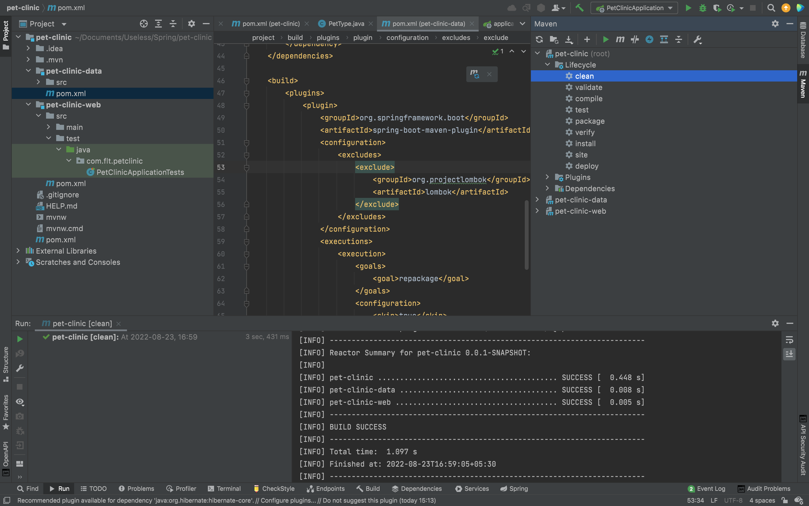

After that, click on `package` to see whether it is packaging properly.

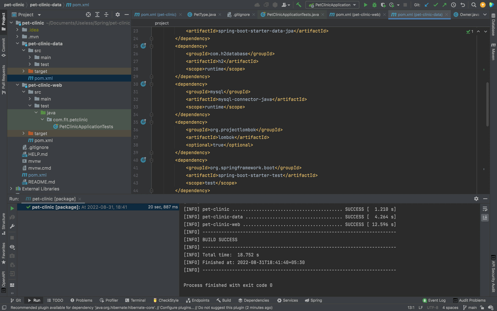


## Step 4 - Using a Version Control System for our Project

When creating a project it is always better to use a version control system, since we don't know when our data might be lost if we are only backing up the project in our local machine. There are quite a few version controlling systems like, github, gitlab and bitbucket in industry. But the most popular one among them is github. So in this project we will use github to do our version controlling. 
To use github, you need to have an account. You can create one by going to [github homepage](https://www.github.com)
After creating a github account, you can go to the `repositories` and create a new repository by clicking on the `new` button. Give the repository name as `pet-clinic` and press `Create Repository` button.

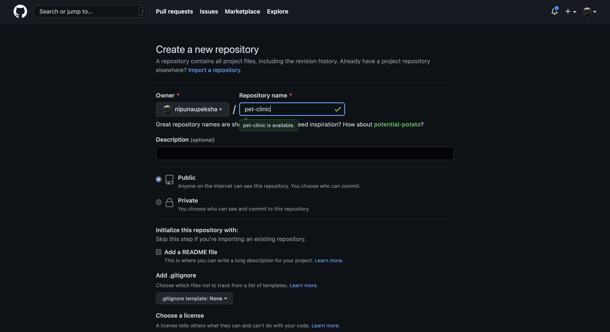

After that, go to the directory containing your project and open `git bash`. To install `git bash` to your local machine you can follow the instructions given by official [documentation](ahttps://git-scm.com/download/) After opening the `git bash` you can run the following commands in order to make your first commit.

- `echo "# pet-clinic" >> README.md`
- `git init`
- `git add README.md`
- `git commit -m "first commit"`
- `git branch -M main`
- `git remote add origin git@github.com:<your_github_username>/pet-clinic.git`
- `git push -u origin main`

After making your first commit, go to your project at InteiiJ and you will see all the files except `README.md` file has been marked in red. This is because we haven't committed the files we already have on our project. To make things easier, we will set up the VCS(Version Control System) configurations in IntelliJ and use them. To add your github account to IntelliJ you can use the [documentation](https://www.jetbrains.com/help/idea/github.html#register-account) provided by JetBrains team. After linking the github profile, open the `Manage Remotes` by `Git → Manage Remotes` or double tapping `Shift` key and searching for `Manage Remotes` to check your `origin` is properly set up.

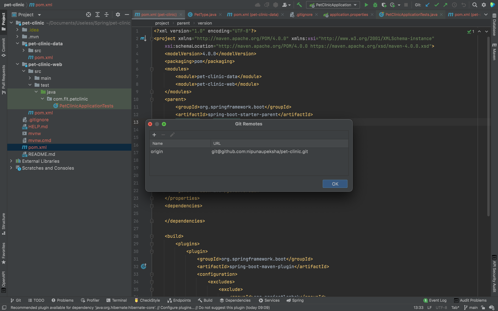

Now, before committing all of the things we have done so far, let's first edit the `.gitignore` file a bit since we do not want to commit unwanted files in to our repository.

```.gitignore
######################
# Project Specific
######################
/build/www/**
/src/test/javascript/coverage/
/src/test/javascript/PhantomJS*/

######################
# Node
######################
/node/
node_tmp/
node_modules/
npm-debug.log.*

######################
# SASS
######################
.sass-cache/

######################
# Eclipse
######################
*.pydevproject
.project
.metadata
tmp/
tmp/**/*
*.tmp
*.bak
*.swp
*~.nib
local.properties
.classpath
.settings/
.loadpath
.factorypath
/src/main/resources/rebel.xml

# External tool builders
.externalToolBuilders/**

# Locally stored "Eclipse launch configurations"
*.launch

# CDT-specific
.cproject

# PDT-specific
.buildpath

######################
# Intellij
######################
.idea/
*.iml
*.iws
*.ipr
*.ids
*.orig

######################
# Visual Studio Code
######################
.vscode/

######################
# Maven
######################
/log/
/target/

######################
# Gradle
######################
.gradle/
/build/

######################
# Package Files
######################
*.jar
*.war
*.ear
*.db

######################
# Windows
######################
# Windows image file caches
Thumbs.db

# Folder config file
Desktop.ini

######################
# Mac OSX
######################
.DS_Store
.svn

# Thumbnails
._*

# Files that might appear on external disk
.Spotlight-V100
.Trashes

######################
# Directories
######################
/bin/
/deploy/
target/

######################
# Logs
######################
*.log

######################
# Others
######################
*.class
*.*~
*~
.merge_file*

######################
# Gradle Wrapper
######################
!gradle/wrapper/gradle-wrapper.jar

######################
# Maven Wrapper
######################
!.mvn/wrapper/maven-wrapper.jar

######################
# ESLint
######################
.eslintcache
```

After, editing `.gitignore` file, commit the project by opening the tab at left pane saying `commit`. At there, type your commit message and click `Commit and Push` to commit and push the changes at the same time.

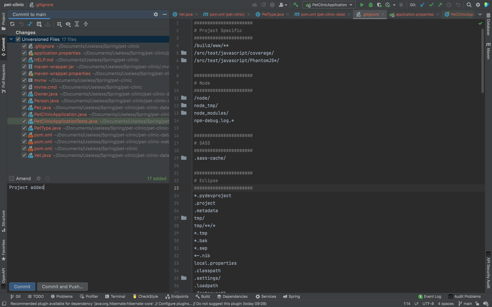

Now if you go to your repository, you can see that all of your code which are not in `.gitigore` file has been uploaded nicely.

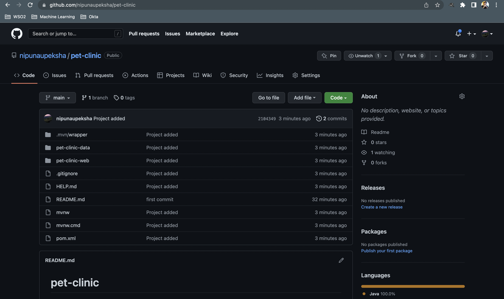

It is better to commit frequently to make sure your code is not up to date with the VCS. I will not mention about committing from here on. But please make sure to commit frequently atleast at the end of the steps mentioned to make the repository up to date.

## Step 5 - Using Maven Release Plugin

Maven release plugin helps you to generate releases of your artifacts with the help of Maven. Although, this a neat tool, there are quite a few plugins to cater releasing artifacts. To start with maven release plugin we will tweak the parent `pom.xml` a little bit.

```xml:title=./pom.xml
<?xml version="1.0" encoding="UTF-8"?>
<project xmlns="http://maven.apache.org/POM/4.0.0" xmlns:xsi="http://www.w3.org/2001/XMLSchema-instance"
	xsi:schemaLocation="http://maven.apache.org/POM/4.0.0 https://maven.apache.org/xsd/maven-4.0.0.xsd">
	<modelVersion>4.0.0</modelVersion>
    <packaging>pom</packaging>
    <modules>
        <module>pet-clinic-data</module>
        <module>pet-clinic-web</module>
    </modules>
    <parent>
		<groupId>org.springframework.boot</groupId>
		<artifactId>spring-boot-starter-parent</artifactId>
		<version>2.7.3</version>
		<relativePath/> <!-- lookup parent from repository -->
	</parent>
	<groupId>com.flt</groupId>
	<artifactId>pet-clinic</artifactId>
	<version>0.0.1-SNAPSHOT</version>
	<name>pet-clinic</name>
	<description>Pet Clinic Web Application</description>
	<properties>
		<java.version>1.8</java.version>
	</properties>

	<build>
		<plugins>
			<plugin>
				<groupId>org.springframework.boot</groupId>
				<artifactId>spring-boot-maven-plugin</artifactId>
				<configuration>
					<excludes>
						<exclude>
							<groupId>org.projectlombok</groupId>
							<artifactId>lombok</artifactId>
						</exclude>
					</excludes>
				</configuration>
			</plugin>
			<plugin>
				<groupId>org.apache.maven.plugins</groupId>
				<artifactId>maven-release-plugin</artifactId>
				<configuration>
					<goals>install</goals>
					<autoVersionSubmodules>true</autoVersionSubmodules>
				</configuration>
			</plugin>
		</plugins>
	</build>

	<scm>
		<developerConnection>scm:git:git@github.com:<user_name>/pet-clinic.git</developerConnection>
		<tag>HEAD</tag>
	</scm>
</project>
```

After adding the `maven-release-plugin` and pushing those changes to git, type `mvn release:prepare` in terminal to make sure everything is right. If everything went smoothly you will see the `BUILD SUCCESS` in IntelliJ IDEA terminal and the following in the git repository.

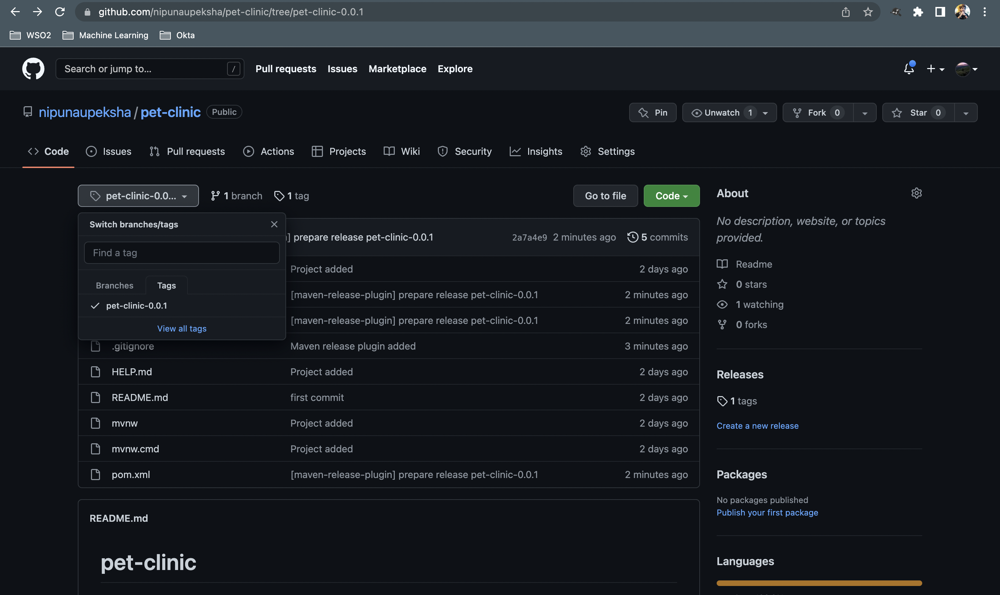

If you see the sub-modules have been `SKIPPED` it is because we have added `<autoVersionSubModules>true</autoVersionSubModules>`. And you may notice that, there are few backup files have been created as well.

After `mvn release:prepare` we can run `mvn release:perform`

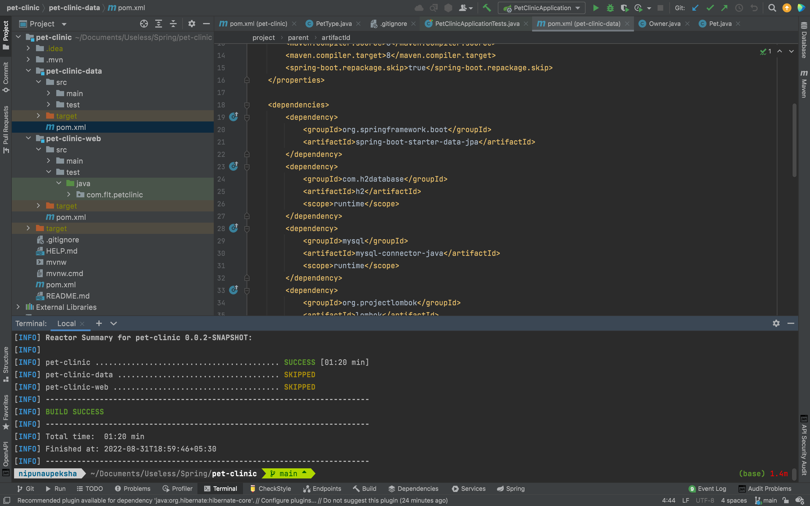

After `mvn release:perform` you can see that the unwanted backup files have been removed and we have performed the release correctly. So what is the difference between `prepare` and `perform`. The `prepare` method makes sure the git has a release under the tag we specified and `perform` makes sure to take that release from git and build it locally. If you go to `./target/checkout/pom.xml` you will notice that the version is not an `SNAPSHOT` version but a real release version.

## Step 6 - Services

In this section we will create services to interact with repositories and controllers that we will look at next. So basically what we are going to do is, we are using repositories to get the data from the database and use services to manipulate those data to get results. After that, those results are sent to the controllers to either show them send them in the response. To do that we will first create a new package in `pet-clinic-data` module. After adding that package our folder structure would look like this.

```shell
.
├── HELP.md
├── README.md
├── mvnw
├── mvnw.cmd
├── pet-clinic-data
│   ├── pom.xml
│   ├── src
│   │   ├── main
│   │   │   ├── java
│   │   │   │   └── com.flt.petclinic
│   │   │   │               ├── model
│   │   │   │               │   ├── Owner.java
│   │   │   │               │   ├── Person.java
│   │   │   │               │   ├── Pet.java
│   │   │   │               │   ├── PetType.java
│   │   │   │               │   └── Vet.java
│   │   │   │               └── services
│   │   │   └── resources
│   │   └── test
│   │       └── java
│   └── target
├── pet-clinic-web
│   ├── pom.xml
│   ├── src
│   │   ├── main
│   │   │   ├── java
│   │   │   │   └── com.flt.petclinic
│   │   │   │               └── PetClinicApplication.java
│   │   │   └── resources
│   │   │       ├── application.properties
│   │   │       ├── static
│   │   │       └── templates
│   │   └── test
│   │       └── java
│   │           └── com.flt.petclinic
│   │                       └── PetClinicApplicationTests.java
│   └── target
├── pom.xml
└── target
```

Then inside that `services` package we will create three new interfaces. The reasons we create these as interfaces first is to follow the `Interface Segregation Principle` in SOLID principles and to use dependency injection.  Inside that service, we will intorduce few methods as well.

```java:title=./pet-clinic-data/src/main/java/com/flt/petclinic/services/OwnerService.java
package com.flt.petclinic.services;

import com.flt.petclinic.model.Owner;

import java.util.Set;

public interface OwnerService {

    Owner findByLastName(String lastName);

    Owner findById(Long id);

    Owner save(Owner owner);

    Set<Owner> findAll();
}
```
```java:title=./pet-clinic-data/src/main/java/com/flt/petclinic/services/PetService.java
package com.flt.petclinic.services;

import com.flt.petclinic.model.Pet;

import java.util.Set;

public interface PetService {

    Pet findById(Long id);

    Pet save(Pet owner);

    Set<Pet> findAll();
}
```

```java:title=./pet-clinic-data/src/main/java/com/flt/petclinic/services/VetService.java
package com.flt.petclinic.services;

import com.flt.petclinic.model.Vet;

import java.util.Set;

public interface VetService {

    Vet findById(Long id);

    Vet save(Vet vet);

    Set<Vet> findAll();
}
```

## Step 7 - Implement Base Entity

Since we need `id` attribute in our model classes to get the value from database, we need to add it as an attribute too. But, we need to add the getters and setters to every model class. That is not efficient and if we need to add another common attribute we have to add that and the getters and setters to every model class as well. So we can overcome this issue by creating a `BaseEntity` and inherit them from it. 

```java:title=./pet-clinic-data/src/main/java/com/flt/petclinic/model/BaseEntity.java
package com.flt.petclinic.model;

import java.io.Serializable;

public class BaseEntity implements Serializable {

    private Long id;

    public Long getId() {

        return id;
    }

    public void setId(Long id) {

        this.id = id;
    }
}
```

After creating `BaseEntity` class we make sure `Pet`, `PetType` and `Person` classes inherit it. We don't need to inherit it to `Vet` and `Owner` since they are getting inheritance from `Person` class.

```java:title=./pet-clinic-data/src/main/java/com/flt/petclinic/model/Person.java
package com.flt.petclinic.model;

public class Person extends BaseEntity{

    private String firstName;
    private String lastName;

    public String getFirstName() {

        return firstName;
    }

    public void setFirstName(String firstName) {

        this.firstName = firstName;
    }

    public String getLastName() {

        return lastName;
    }

    public void setLastName(String lastName) {

        this.lastName = lastName;
    }
}
```
```java:title=./pet-clinic-data/src/main/java/com/flt/petclinic/model/Pet.java
package com.flt.petclinic.model;

import java.time.LocalDate;

public class Pet extends BaseEntity{

    private PetType petType;
    private Owner owner;
    private LocalDate birthDate;

    public PetType getPetType() {

        return petType;
    }

    public void setPetType(PetType petType) {

        this.petType = petType;
    }

    public Owner getOwner() {

        return owner;
    }

    public void setOwner(Owner owner) {

        this.owner = owner;
    }

    public LocalDate getBirthDate() {

        return birthDate;
    }

    public void setBirthDate(LocalDate birthDate) {

        this.birthDate = birthDate;
    }
}
```

```java:title=./pet-clinic-data/src/main/java/com/flt/petclinic/model/PetType.java
package com.flt.petclinic.model;

public class PetType extends BaseEntity{

    private String name;

    public String getName() {

        return name;
    }

    public void setName(String name) {

        this.name = name;
    }
}
```

## Step 8 - Custom Banner

Since we coded a little bit, if you run the `PetClinicApplication` in `pet-clinic-web` you will see an ASCII key art. So now, we are going to change that to our application name. Let's first look at how you can add an ASCII art as name. To do that visit [patorjk.com](https://patorjk.com/) and type `Pet Clinic Application` as the text and copy the ASCII art. Then go to `pet-clinic-web/src/main/resources/` and create a new text file named `banner.txt` and paste the ASCII art there. And now, if you run `PetClinicApplication` you will see the following.

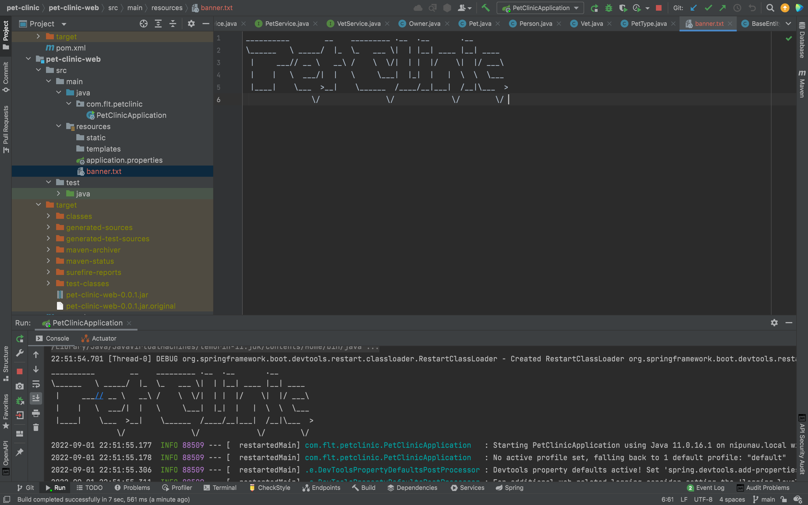

But, what if we need to have file name as `petclinic.txt` and not as `banner.txt`? Then we need to add that as a application property to the `application.properties` file since `banner.txt` is the default value.

```properties:title=./pet-clinic-web/src/main/resources/application.properties
spring.banner.location=classpath:petclinic.txt
```

If you need to add an image as your custom banner, you can do it as well by adding the file to `resources` directory and setting it in the `application.properties` file.

```properties:title=./pet-clinic-web/src/main/resources/application.properties
spring.banner.image.location=classpath:petclinic.png
spring.banner.image.width=100
spring.banner.image.height=100
spring.banner.image.margin=8
```

## Step 9 - Refactor Services to Common Interface

Although we created the service interfaces, we can see that they all have `findAll()`, `findById()` and `save()` methods. So what we can do here is use a common interface to have those methods.

```java:title=./pet-clinic-data/src/main/java/com/flt/petclinic/services/CrudService.java
package com.flt.petclinic.services;

import java.util.Set;

public interface CrudService<T, ID> {

    Set<T> findAll();

    T findById(ID id);

    T save(T object);
    
    void delete(T object);
    
    void deleteById(ID id);
}
```

You can see that I have used generics here, to be compatible with all of our other service interfaces. If you want to learn more about Java generics you can go to this [link.](https://www.baeldung.com/java-generics)

After implementing the `CrudService` we can extend that to inherit the methods.

```java:title=./pet-clinic-data/src/main/java/com/fltpetclinic/services/VetService.java
package com.flt.petclinic.services;

import com.flt.petclinic.model.Vet;

public interface VetService extends CrudService<Vet, Long> {

}
```

```java:title=./pet-clinic-data/src/main/java/com/fltpetclinic/services/OwnerService.java
package com.flt.petclinic.services;

import com.flt.petclinic.model.Owner;

public interface OwnerService extends CrudService<Owner, Long> {

    Owner findByLastName(String lastName);
}
```

```java:title=./pet-clinic-data/src/main/java/com/fltpetclinic/services/PetService.java
package com.flt.petclinic.services;

import com.flt.petclinic.model.Pet;

public interface PetService extends CrudService<Pet, Long>{

}
```

## Step 10 - Implement Map Based Services
To implement map based services, let's first create a new directory inside the services named as `map`. And inside that we will create a new abstract class named `AbstractMapService`.

```java:title=./pet-clinic-data/src/main/java/com/fltpetclinic/services/map/AbstractMapService.java
package com.flt.petclinic.services.map;

import java.util.HashMap;
import java.util.HashSet;
import java.util.Map;
import java.util.Set;

public abstract class AbstractMapService<T, ID> {

    protected Map<ID, T> map = new HashMap<>();

    Set<T> findAll() {

        return new HashSet<>(map.values());
    }

    T findById(ID id) {

        return map.get(id);
    }

    T save(ID id, T object) {

        map.put(id, object);
        return object;
    }

    void deleteById(ID id) {

        map.remove(id);
    }

    void delete(T object) {

        map.entrySet().removeIf(entry -> entry.getValue().equals(object));
    }
}
```

Using this `AbstractMapService` we can create three new classes `OwnerServiceMap`, `PetServiceMap` and `VetServiceMap`.

```java:title=./pet-clinic-data/src/main/java/com/fltpetclinic/services/map/OwnerServiceMap.java
package com.flt.petclinic.services.map;

import com.flt.petclinic.model.Owner;
import com.flt.petclinic.services.CrudService;

import java.util.Set;

public class OwnerServiceMap extends AbstractMapService<Owner, Long> implements CrudService<Owner, Long> {

    @Override
    public Set<Owner> findAll() {

        return super.findAll();
    }

    @Override
    public void deleteById(Long id) {

    }

    @Override
    public void delete(Owner object) {

    }

    @Override
    public Owner save(Owner object) {

        return super.save(object.getId(), object);
    }

    @Override
    public Owner findById(Long id) {

        return super.findById(id);
    }
}
```

```java:title=./pet-clinic-data/src/main/java/com/fltpetclinic/services/map/VetServiceMap.java
package com.flt.petclinic.services.map;

import com.flt.petclinic.model.Vet;
import com.flt.petclinic.services.CrudService;

import java.util.Set;

public class VetServiceMap extends AbstractMapService<Vet, Long> implements CrudService<Vet, Long> {

    @Override
    public Set<Vet> findAll() {

        return super.findAll();
    }

    @Override
    public void deleteById(Long id) {

        super.deleteById(id);
    }

    @Override
    public void delete(Vet object) {

        super.delete(object);
    }

    @Override
    public Vet save(Vet object) {

        return super.save(object.getId(), object);
    }

    @Override
    public Vet findById(Long id) {

        return super.findById(id);
    }
}
```

```java:title=./pet-clinic-data/src/main/java/com/fltpetclinic/services/map/PetServiceMap.java
package com.flt.petclinic.services.map;

import com.flt.petclinic.model.Pet;
import com.flt.petclinic.services.CrudService;

import java.util.Set;

public class PetServiceMap extends AbstractMapService<Pet, Long> implements CrudService<Pet, Long> {

    @Override
    public Set<Pet> findAll() {

        return super.findAll();
    }

    @Override
    public void deleteById(Long id) {

        super.deleteById(id);
    }

    @Override
    public void delete(Pet object) {

        super.delete(object);
    }

    @Override
    public Pet save(Pet object) {

        return super.save(object.getId(), object);
    }

    @Override
    public Pet findById(Long id) {

        return super.findById(id);
    }
}
```

## Step 11 - Create Index Page and Controller

Here, we will be creating an index page using HTML and direct to it using the controller. To create our index page, we can go to the `pet-clinic-web/src/main/resources/templates` and create a new file named `index.html`. 

```html:title=./pet-clinic-web/src/main/resources/templates/index.html
<!DOCTYPE html>
<html lang="en" xmlns:th="http://www.thymeleaf.org">
    <head>
        <meta charset="UTF-8"/>
        <title>Pet Clinic Index</title>
    </head>
    <body>
        <h1 th:text="Index page">Index page</h1>
    </body>
</html>
```

Since, in the beginning of the article we mentioned that we will be using Thymeleaf as the web templating engine for our project, you can see that I have added the Thymeleaf namespace in here as well. 

Now, we can create our controller class to which will direct us to that page. To do that, we need to create a new package named `controllers` in our `pet-clinic-web` module. And inside that, we will create a new Java class named `IndexController`. 

```java:title=./pet-clinic-web/src/main/java/com/flt/petclinic/controllers/IndexController.java
package com.flt.petclinic.controllers;

import org.springframework.stereotype.Controller;
import org.springframework.web.bind.annotation.RequestMapping;

@Controller
public class IndexController {

    @RequestMapping({"","/","index","index.html"})
    public String index() {

        return "index";
    }
}
```
And now, if you run the `PetClinicApplication`, go to the browser and type `localhost:8080`, you will see the following.

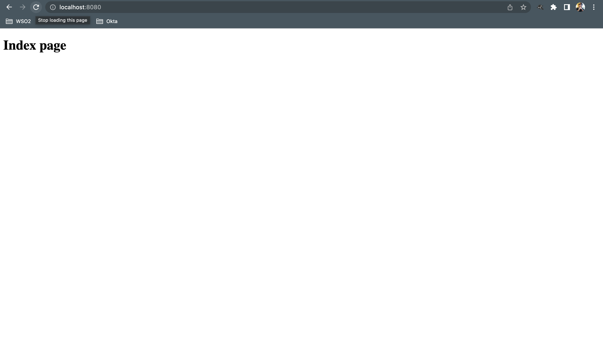

## Step 12 - Create Vet/Owner Index page and Controller

To create the index page for vets, we can perform the same process that we did in step 11. But for the code quality we will be doing it by creating a new directory named `vets` inside `pet-clinic-web/src/main/resources/templates`. After creating the directory we can create another `index.html` inside `vets` package.

```html:title=./pet-clinic-web/src/main/resources/templates/vets/index.html
<!DOCTYPE html>
<html lang="en" xmlns:th="http://www.thymeleaf.org">
<head>
    <meta charset="UTF-8">
    <title>Vet Index Page</title>
</head>
<body>
    <h1 th:text="'Index page for vets'">Index page for vets</h1>
</body>
</html>
```

After creating the `index.html` file, create a new controller inside our `controlllers` package, named `VetController`.

```java:title=./pet-clinic-web/src/main/java/com/flt/petclinic/controllers/VetController.java
package com.flt.petclinic.controllers;

import org.springframework.stereotype.Controller;
import org.springframework.web.bind.annotation.RequestMapping;

@Controller
public class VetController {

    @RequestMapping({"/vets", "/vets/index", "/vets/index.html"})
    public String index() {

        return "vets/index";
    }
}
```

And if you run `PetClinicApplication`, go to the browser and type `localhost:8080/vets`, you will see the following.

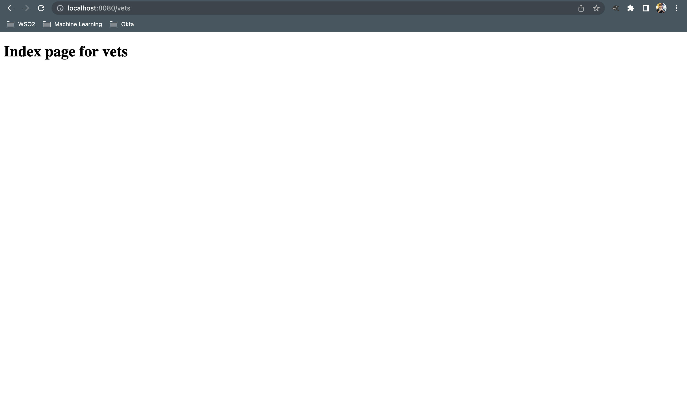

Following step 11 and step 12, we can create the index page for owners as well.

```html:title=./pet-clinic-web/src/main/resources/templates/oweners/index.html
<!DOCTYPE html>
<html lang="en" xmlns:th="http://www.thymeleaf.org">
<head>
    <meta charset="UTF-8">
    <title>Title</title>
</head>
<body>
  <h1 th:text="'Index page for owners'">Index page for owners</h1>
</body>
</html>
```

```java:title=./pet-clinic-web/src/main/java/com/flt/petclinic/OwnerController.java
package com.flt.petclinic.controllers;

import org.springframework.stereotype.Controller;
import org.springframework.web.bind.annotation.RequestMapping;

@Controller
public class OwnerController {

    @RequestMapping({"/owners", "/owners/index", "/owners/index.html"})
    public String index() {

        return "owners/index";
    }
}
```
And And if you run `PetClinicApplication`, go to the browser and type `localhost:8080/owners`, you will see the following.

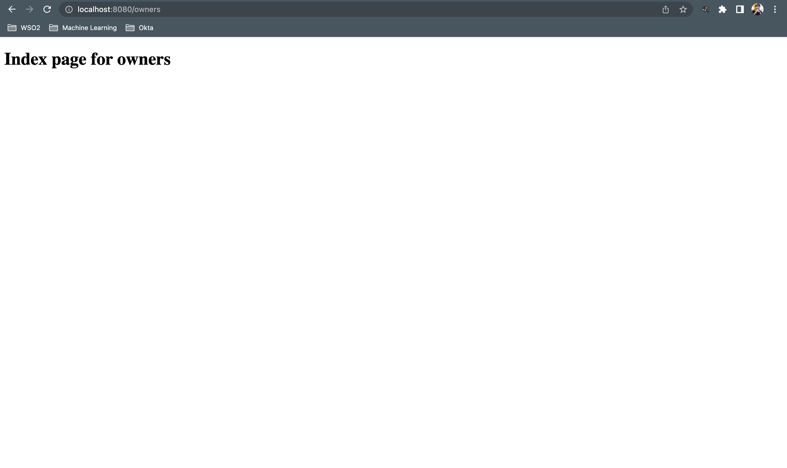

As we can see that all the requests of `OwnerController` starts from `owners/` and all the requests of `VetController` starts from `vets/` we can refactor those classes to following.

```java:title=./pet-clinic-web/src/main/java/com/flt/petclinic/OwnerController.java
package com.flt.petclinic.controllers;

import org.springframework.stereotype.Controller;
import org.springframework.web.bind.annotation.RequestMapping;

@RequestMapping("/owners")
@Controller
public class OwnerController {

    @RequestMapping({"","/", "/index", "/index.html"})
    public String index() {

        return "owners/index";
    }
}
```

```java:title=./pet-clinic-web/src/main/java/com/flt/petclinic/VetsController.java
package com.flt.petclinic.controllers;

import org.springframework.stereotype.Controller;
import org.springframework.web.bind.annotation.RequestMapping;

@RequestMapping("/vets")
@Controller
public class VetController {

    @RequestMapping({"", "/", " /index", " /index.html"})
    public String index() {

        return "vets/index";
    }
}
```

## Step 13 - Load data on startup

To do this we will create a new package in `pet-clinic-web/com/flt/petclinic` named `bootstrap`.Inside that we will create a new class named `DataLoader`. But to use this new class we need to update the `OwnerServiceMap`, `VetServiceMap` and `PetServiceMap` classes first.

```java:title=./pet-clinic-data/src/main/java/com/flt/petclinic/services/map/OwnerServiceMap.java
package com.flt.petclinic.services.map;

import com.flt.petclinic.model.Owner;
import com.flt.petclinic.services.OwnerService;
import org.springframework.stereotype.Service;

import java.util.Set;

@Service
public class OwnerServiceMap extends AbstractMapService<Owner, Long> implements OwnerService {

    @Override
    public Set<Owner> findAll() {

        return super.findAll();
    }

    @Override
    public void deleteById(Long id) {

    }

    @Override
    public void delete(Owner object) {

    }

    @Override
    public Owner save(Owner object) {

        return super.save(object.getId(), object);
    }

    @Override
    public Owner findById(Long id) {

        return super.findById(id);
    }

    @Override
    public Owner findByLastName(String lastName) {

        return null;
    }
}
```

```java:title=./pet-clinic-data/src/main/java/com/flt/petclinic/services/map/VetServiceMap.java
package com.flt.petclinic.services.map;

import com.flt.petclinic.model.Vet;
import com.flt.petclinic.services.VetService;
import org.springframework.stereotype.Service;

import java.util.Set;

@Service
public class VetServiceMap extends AbstractMapService<Vet, Long> implements VetService {

    @Override
    public Set<Vet> findAll() {

        return super.findAll();
    }

    @Override
    public void deleteById(Long id) {

        super.deleteById(id);
    }

    @Override
    public void delete(Vet object) {

        super.delete(object);
    }

    @Override
    public Vet save(Vet object) {

        return super.save(object.getId(), object);
    }

    @Override
    public Vet findById(Long id) {

        return super.findById(id);
    }
}
```

```java:title=./pet-clinic-data/src/main/java/com/flt/petclinic/services/map/PetServiceMap.java
package com.flt.petclinic.services.map;

import com.flt.petclinic.model.Pet;
import com.flt.petclinic.services.PetService;
import org.springframework.stereotype.Service;

import java.util.Set;

@Service
public class PetServiceMap extends AbstractMapService<Pet, Long> implements PetService {

    @Override
    public Set<Pet> findAll() {

        return super.findAll();
    }

    @Override
    public void deleteById(Long id) {

        super.deleteById(id);
    }

    @Override
    public void delete(Pet object) {

        super.delete(object);
    }

    @Override
    public Pet save(Pet object) {

        return super.save(object.getId(), object);
    }

    @Override
    public Pet findById(Long id) {

        return super.findById(id);
    }
}
```

```java:title=./pet-clinic-web/src/main/java/com/flt/petclinic/bootstrap/DataLoader.java
package com.flt.petclinic.bootstrap;

import com.flt.petclinic.model.Owner;
import com.flt.petclinic.model.Vet;
import com.flt.petclinic.services.OwnerService;
import com.flt.petclinic.services.VetService;
import com.flt.petclinic.services.map.OwnerServiceMap;
import com.flt.petclinic.services.map.VetServiceMap;
import org.springframework.boot.CommandLineRunner;
import org.springframework.stereotype.Component;

@Component
public class DataLoader implements CommandLineRunner {

    private final OwnerService ownerService;
    private final VetService vetService;

    public DataLoader() {

        ownerService = new OwnerServiceMap();
        vetService = new VetServiceMap();
    }

    @Override
    public void run(String... args) throws Exception {

        Owner owner1 = new Owner();
        owner1.setId(1L);
        owner1.setFirstName("Harry");
        owner1.setLastName("Potter");

        ownerService.save(owner1);

        Owner owner2 = new Owner();
        owner2.setId(2L);
        owner2.setFirstName("Ron");
        owner2.setLastName("Weasley");

        ownerService.save(owner2);

        System.out.println("Loaded Owners....");

        Vet vet1 = new Vet();
        vet1.setId(1L);
        vet1.setFirstName("Hermione");
        vet1.setLastName("Granger");

        vetService.save(vet1);

        Vet vet2 = new Vet();
        vet2.setId(1L);
        vet2.setFirstName("Fred");
        vet2.setLastName("Weasley");

        vetService.save(vet2);

        System.out.println("Loaded Vets....");
    }
}
```

## Step 14 - Implement Spring Configuration

Although, in out `DataLoader` class we initialized `OwnerService` and `VetService` inside the constructor, we don't want to do that. What we need to do is letting Spring to configure it.

```java:title=./pet-clinic-web/src/main/java/com/flt/petclinic/bootstrap/DataLoader.java
package com.flt.petclinic.bootstrap;

import com.flt.petclinic.model.Owner;
import com.flt.petclinic.model.Vet;
import com.flt.petclinic.services.OwnerService;
import com.flt.petclinic.services.VetService;
import org.springframework.boot.CommandLineRunner;
import org.springframework.stereotype.Component;

@Component
public class DataLoader implements CommandLineRunner {

    private final OwnerService ownerService;
    private final VetService vetService;

    public DataLoader(OwnerService ownerService, VetService vetService) {

        this.ownerService = ownerService;
        this.vetService = vetService;
    }

    @Override
    public void run(String... args) throws Exception {

        Owner owner1 = new Owner();
        owner1.setId(1L);
        owner1.setFirstName("Harry");
        owner1.setLastName("Potter");

        ownerService.save(owner1);

        Owner owner2 = new Owner();
        owner2.setId(2L);
        owner2.setFirstName("Ron");
        owner2.setLastName("Weasley");

        ownerService.save(owner2);

        System.out.println("Loaded Owners....");

        Vet vet1 = new Vet();
        vet1.setId(1L);
        vet1.setFirstName("Hermione");
        vet1.setLastName("Granger");

        vetService.save(vet1);

        Vet vet2 = new Vet();
        vet2.setId(2L);
        vet2.setFirstName("Fred");
        vet2.setLastName("Weasley");

        vetService.save(vet2);

        System.out.println("Loaded Vets....");
    }
}
```
What we are doing here is called the dependency injection and we can use `@Autowired` annotation above the constructor if needed as it is optional.


## Step 15 - List Owners

To list the owners first thing we need to do is get a handle on the `OwnerService` in our `OwnerController`. After injecting the `OwnerService` using constructor dependency injection, we inject the dependency. 

```java:title=./pet-clinic-web/src/main/java/com/flt/petclinic/controllers/OwnerController.java
package com.flt.petclinic.controllers;

import com.flt.petclinic.services.OwnerService;
import org.springframework.stereotype.Controller;
import org.springframework.ui.Model;
import org.springframework.web.bind.annotation.RequestMapping;

@RequestMapping("/owners")
@Controller
public class OwnerController {

    private final OwnerService ownerService;

    public OwnerController(OwnerService ownerService) {

        this.ownerService = ownerService;
    }

    /**
     * List owners in the index page.
     * @param model Model object.
     * @return The index page listing the owners.
     */
    @RequestMapping({"","/", "/index", "/index.html"})
    public String index(Model model) {

        model.addAttribute("owners", ownerService.findAll());
        return "owners/index";
    }
}
```

And now, we can update the `index` page of owners to list the owners in our web app.

```html:./pet-clinic-web/src/main/resources/templates/owners/index.html
<!DOCTYPE html>
<html lang="en" xmlns:th="http://www.thymeleaf.org">
<head>
    <meta charset="UTF-8">
    <title>List of Pet Owners</title>
</head>
<body>
<!--/*@thymesVar id="owner" type="com.flt.petclinic.model.Owner"*/-->
<h1 th:text="'List of owners'">Owners List</h1>
<table>
    <thead>
    <tr>
        <th>Id</th>
        <th>First Name</th>
        <th>Last Name</th>
    </tr>
    </thead>
    <tbody>
    <tr th:each="owner:${owners}">
        <td th:text="${owner.id}">1</td>
        <td th:text="${owner.firstName}">Tyrion</td>
        <td th:text="${owner.lastName}">Lannister</td>
    </tr>
    </tbody>
</table>
</body>
</html>
```
Here, adding the comment `<!--/*@thymesVar id="owner" type="com.flt.petclinic.model.Owner"*/-->` helps IntelliJ intellisense to identify the `Owner` object. Now, if you run this and type `localhost:8080/owners` you will see the following.


## Step 16 - List Vets

Following the step 15, we can list the vets.

```java:title=./pet-clinic-web/src/main/java/com/flt/petclinic/controllers/VetController.java
package com.flt.petclinic.controllers;

import com.flt.petclinic.services.VetService;
import org.springframework.stereotype.Controller;
import org.springframework.ui.Model;
import org.springframework.web.bind.annotation.RequestMapping;

@RequestMapping("/vets")
@Controller
public class VetController {

    private final VetService vetService;

    public VetController(VetService vetService) {

        this.vetService = vetService;
    }

    @RequestMapping({"", "/", " /index", " /index.html"})
    public String index(Model model) {

        model.addAttribute("vets", vetService.findAll());
        return "vets/index";
    }
}
```

```html:./pet-clinic-web/src/main/resources/templates/vets/index.html
<!DOCTYPE html>
<html lang="en" xmlns:th="http://www.thymeleaf.org">
<head>
    <meta charset="UTF-8">
    <title>List of Vets</title>
</head>
<body>
<!--/*@thymesVar id="vet" type="com.flt.petclinic.model.Vet"*/-->
<h1 th:text="'List of Vets'">Vets List</h1>
<table>
    <thead>
    <tr>
        <th>Id</th>
        <th>First Name</th>
        <th>Last Name</th>
    </tr>
    </thead>
    <tbody>
    <tr th:each="vet:${vets}">
        <td th:text="${vet.id}">1</td>
        <td th:text="${vet.firstName}">Jaime</td>
        <td th:text="${vet.lastName}">Lannister</td>
    </tr>
    </tbody>
</table>
</body>
</html>
```
Now if you go to `localhost:8080/vets` you can observe the following.

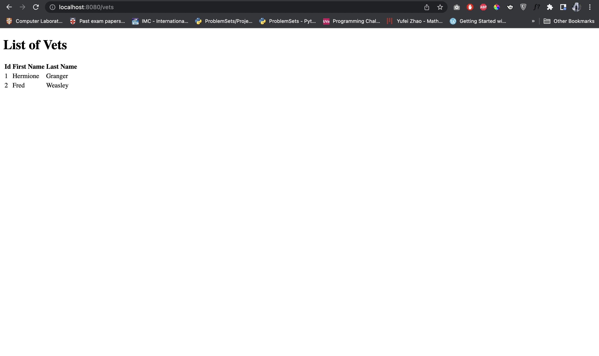

## Step 17 - Auto Generate Map IDs

To make the ID autogenerate we can implement the following in the `AbstractMapService` class and refactor the `OwnerServiceMap`, `PetServiceMap` and `VetServiceMap`.

```java:title=./pet-clinic-data/src/main/java/com/flt/petclinic/services/map/AbstractMapService.java
package com.flt.petclinic.services.map;

import com.flt.petclinic.model.BaseEntity;

import java.util.Collections;
import java.util.HashMap;
import java.util.HashSet;
import java.util.Map;
import java.util.NoSuchElementException;
import java.util.Set;

public abstract class AbstractMapService<T extends BaseEntity, ID extends Long> {

    protected Map<Long, T> map = new HashMap<>();

    Set<T> findAll() {

        return new HashSet<>(map.values());
    }

    T findById(ID id) {

        return map.get(id);
    }

    T save(T object) {

        if (object != null) {
            if (object.getId() == null) {
                object.setId(getNextId());
            }
            map.put(object.getId(), object);
        }
        return object;
    }

    void deleteById(ID id) {

        map.remove(id);
    }

    void delete(T object) {

        map.entrySet().removeIf(entry -> entry.getValue().equals(object));
    }

    private Long getNextId() {

        Long nextId = null;
        try {
            nextId = Collections.max(map.keySet()) + 1;
        } catch (NoSuchElementException e) {
            nextId = 1L;
        }
        return nextId;
    }
}
```

```java:title=./pet-clinic-data/src/main/java/com/flt/petclinic/services/map/OwnerServiceMap.java
package com.flt.petclinic.services.map;

import com.flt.petclinic.model.Owner;
import com.flt.petclinic.services.OwnerService;
import org.springframework.stereotype.Service;

import java.util.Set;

@Service
public class OwnerServiceMap extends AbstractMapService<Owner, Long> implements OwnerService {

    @Override
    public Set<Owner> findAll() {

        return super.findAll();
    }

    @Override
    public void deleteById(Long id) {

    }

    @Override
    public void delete(Owner object) {

    }

    @Override
    public Owner save(Owner object) {

        return super.save(object);
    }

    @Override
    public Owner findById(Long id) {

        return super.findById(id);
    }

    @Override
    public Owner findByLastName(String lastName) {

        return null;
    }
}
```

```java:title=./pet-clinic-data/src/main/java/com/flt/petclinic/services/map/PetServiceMap.java
package com.flt.petclinic.services.map;

import com.flt.petclinic.model.Pet;
import com.flt.petclinic.services.PetService;
import org.springframework.stereotype.Service;

import java.util.Set;

@Service
public class PetServiceMap extends AbstractMapService<Pet, Long> implements PetService {

    @Override
    public Set<Pet> findAll() {

        return super.findAll();
    }

    @Override
    public void deleteById(Long id) {

        super.deleteById(id);
    }

    @Override
    public void delete(Pet object) {

        super.delete(object);
    }

    @Override
    public Pet save(Pet object) {

        return super.save(object);
    }

    @Override
    public Pet findById(Long id) {

        return super.findById(id);
    }
}
```

```java:title=./pet-clinic-data/src/main/java/com/flt/petclinic/services/map/VetServiceMap.java
package com.flt.petclinic.services.map;

import com.flt.petclinic.model.Vet;
import com.flt.petclinic.services.VetService;
import org.springframework.stereotype.Service;

import java.util.Set;

@Service
public class VetServiceMap extends AbstractMapService<Vet, Long> implements VetService {

    @Override
    public Set<Vet> findAll() {

        return super.findAll();
    }

    @Override
    public void deleteById(Long id) {

        super.deleteById(id);
    }

    @Override
    public void delete(Vet object) {

        super.delete(object);
    }

    @Override
    public Vet save(Vet object) {

        return super.save(object);
    }

    @Override
    public Vet findById(Long id) {

        return super.findById(id);
    }
}
```

In addition, we can refactor out `DataLoader` class as well. 

```java:title=./pet-clinic-web/src/main/java/com/flt/petclinic/bootstrap/DataLoader.java
package com.flt.petclinic.bootstrap;

import com.flt.petclinic.model.Owner;
import com.flt.petclinic.model.Vet;
import com.flt.petclinic.services.OwnerService;
import com.flt.petclinic.services.VetService;
import org.springframework.boot.CommandLineRunner;
import org.springframework.stereotype.Component;

@Component
public class DataLoader implements CommandLineRunner {

    private final OwnerService ownerService;
    private final VetService vetService;

    public DataLoader(OwnerService ownerService, VetService vetService) {

        this.ownerService = ownerService;
        this.vetService = vetService;
    }

    @Override
    public void run(String... args) throws Exception {

        Owner owner1 = new Owner();
        owner1.setFirstName("Harry");
        owner1.setLastName("Potter");

        ownerService.save(owner1);

        Owner owner2 = new Owner();
        owner2.setFirstName("Ron");
        owner2.setLastName("Weasley");

        ownerService.save(owner2);

        System.out.println("Loaded Owners....");

        Vet vet1 = new Vet();
        vet1.setFirstName("Hermione");
        vet1.setLastName("Granger");

        vetService.save(vet1);

        Vet vet2 = new Vet();
        vet2.setFirstName("Fred");
        vet2.setLastName("Weasley");

        vetService.save(vet2);

        System.out.println("Loaded Vets....");
    }
}
```


## References
This list contains the tips and tricks that you should know when diving into Spring development.
1. Dependency Injection
2. 